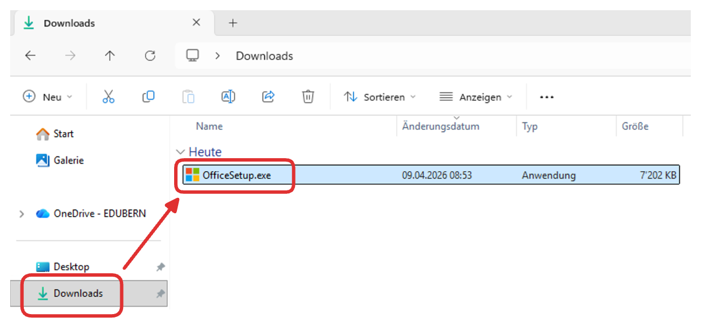
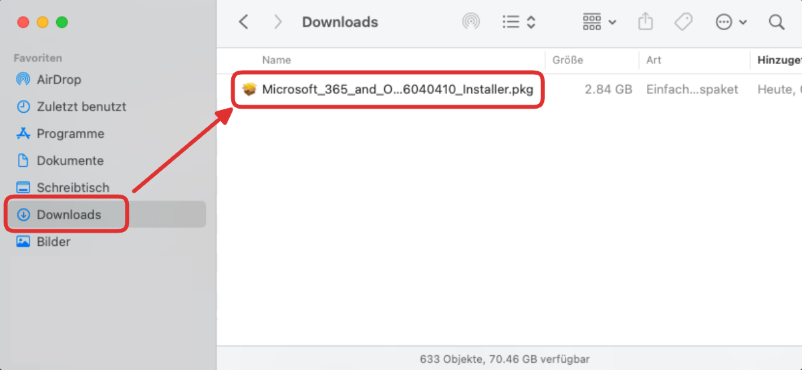

---
sidebar_custom_props:
  icon: mdiMicrosoftOffice
page_id: 0400482c-5502-4af8-aaff-e5bbea4d31f5
---

import PageReadCheck from '@tdev/page-read-check/PageReadCheck';
import ProgressState from '@tdev-components/documents/ProgressState';

# Microsoft Office Programme
Die Schule stellt Ihnen die Microsoft Office 365 Suite kostenlos zur Verfügung. Darin enthalten sind Programme, mit dienen Sie intensiv arbeiten werden. Dazu gehören:
- Word (Textverarbeitung)
- Excel (Tabellenkalkulation)
- PowerPoint (Präsentationen)
- OneNote (Notizen, Unterrichtsmaterial)
- Teams, Outlook (Kommunikation und Zusammenarbeit)

Laden Sie die Office-Programme herunter und installieren Sie sie auf Ihrem Computer.

<ProgressState id="432d5687-e6c3-4f3a-8cc1-041aa70c7aca" keepPreviousStepsOpen confirm float="right">
    1. Öffnen Sie die [Download-Seite für Office 365](https://www.microsoft.com/de-de/microsoft-365/download-office).
    2. Wählen Sie den passenden Download für Ihr Betriebssystem aus (Windows oder macOS).
       
    3. Gehen Sie in Ihren Downloads-Ordner und führen Sie die heruntergeladene Installationsdatei aus (Doppelklick). Folgen Sie danach den Anweisungen des Installationsprogramms.
       <Tabs groupId="os">
         <TabItem value="win" label="Windows">
           
         </TabItem>
         <TabItem value="macos" label="macOS">
           
         </TabItem>
       </Tabs>
       :::finding[Typischer Ablauf]
       Auf Laptops werden Programme nur selten über einen App Store installiert. Das Herunterladen und Ausführen einer Installationsdatei ist also der typische Weg, um neue Programme zu installieren. Sie können sich diesen Ablauf also gleich merken!
       :::
    4. Sobald die Installation abgeschlossen ist, löschen Sie die Installationsdatei aus Ihrem Downloads-Ordner. Diese benötigen Sie nicht mehr.
       :::finding[Installationsdatei ≠ Programm]
       Die Installationsdatei ist lediglich ein Programm, mit dem man das eigentliche Programm installiert. Das gilt nicht nur bei der Installation der Office-Programme. Sobald die Installation abgeschlossen ist, wird das eigentliche Programm auf Ihrem Computer installiert und die Installationsdatei wird nicht mehr benötigt. Würden Sie die Installationsdatei ein zweites Mal ausführen, würde sich nicht das eigentliche Programm öffnen, sondern es würde einfach nochmal die Installation gestartet. 
       :::
    5. Öffnen Sie mindestens die Programme __Word__, __Teams__, __OneNote__ und __Outlook__ und melden Sie sich mit Ihrem Schulkonto an, wenn Sie nach einer Anmeldung gefragt werden.
    6. Die Installation ist abgeschlossen. Sie können die geöffneten Office-Programme wieder schliessen.
</ProgressState>

---

<PageReadCheck id="ca3bd0c0-7610-4a24-95f6-117b3122b6da" />