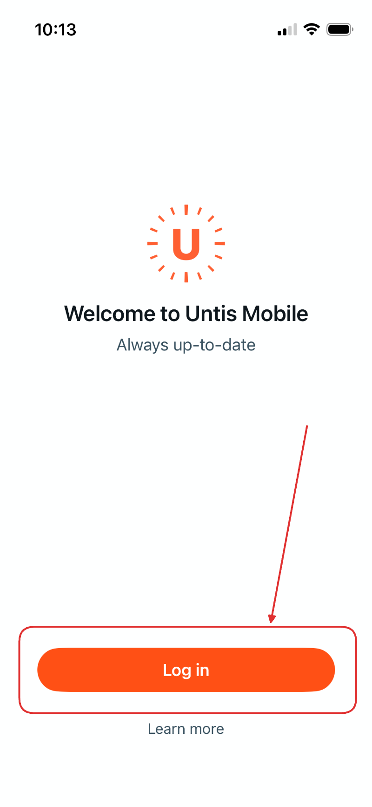
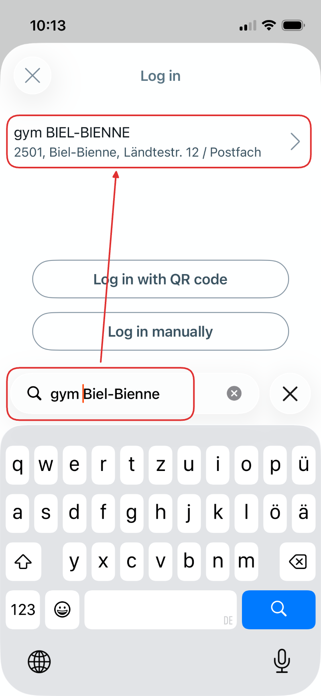
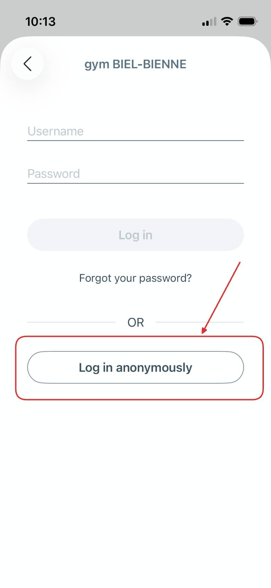
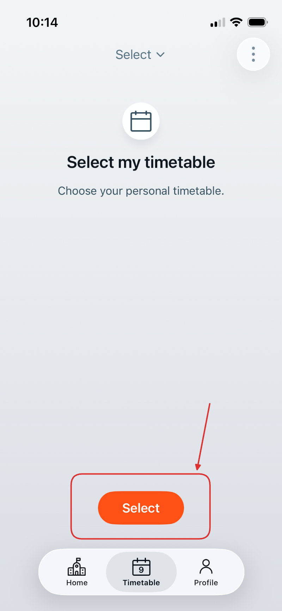
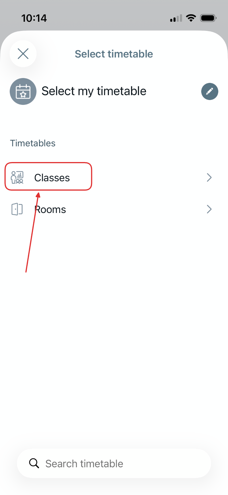
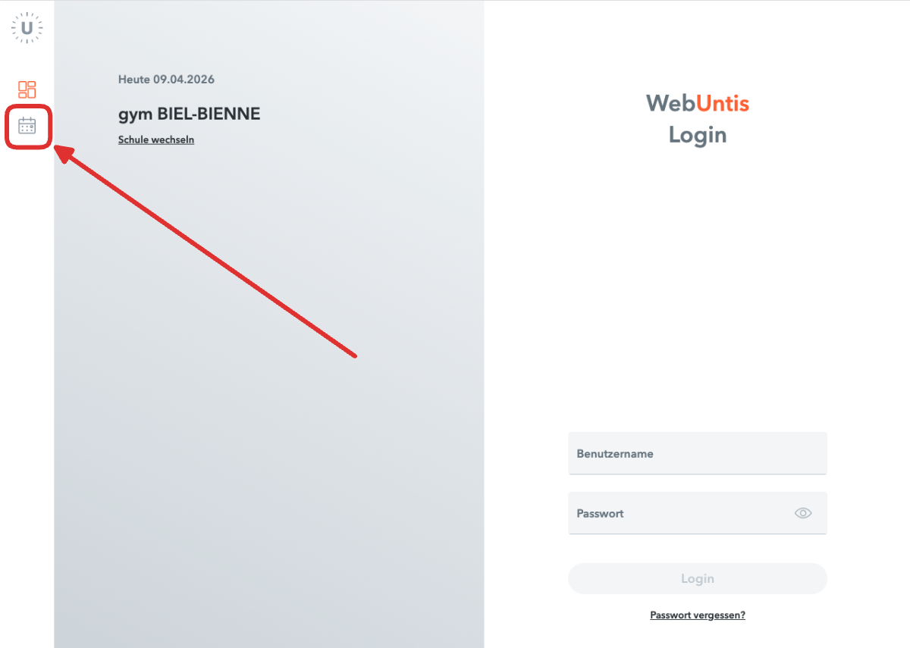
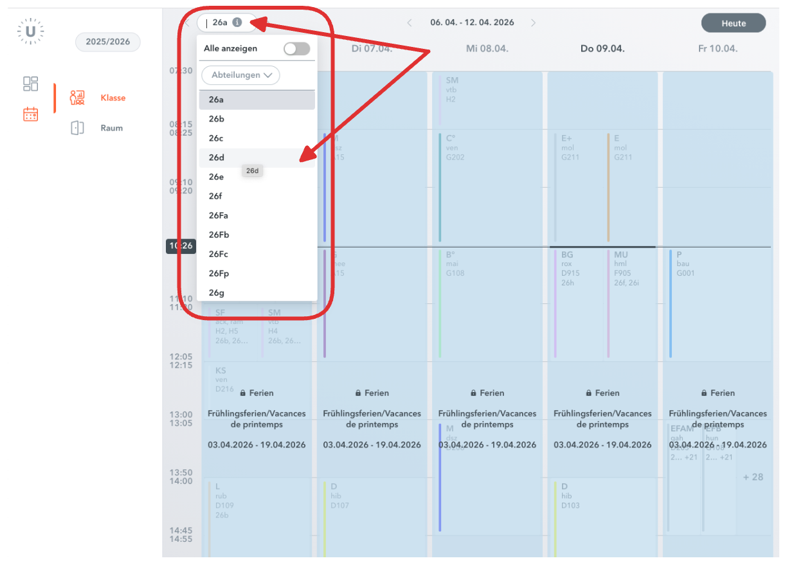

import PageReadCheck from '@tdev/page-read-check/PageReadCheck';

# Stundenplan
Der Stundenplan ist sowohl am Laptop als auch am Smartphone digital verfügbar. Wählen Sie hier die entsprechende Anleitung aus.

<Tabs groupId="device">
    <TabItem value="mobile" label="Smartphone">
        <Steps>
            1. Laden Sie sich die Untis Mobile App aus dem App Store bzw. Google Play Store herunter.
                <Tabs groupId="os">
                    <TabItem value="android" label="Android">
                        
                    </TabItem>
                    <TabItem value="ios" label="iOS">
                        
                    </TabItem>
                </Tabs>
            2. Öffnen Sie die App.
            3. Klicken Sie auf __Log in__.
            
            4. Suchen Sie nach der Schule `gym BIEL-BIENNE` und wählen Sie sie aus.
            
            5. Als Schüler:innen haben Sie keine Login-Daten. Loggen Sie sich also **anonym** ein.
            
            6. Gehen Sie zum Stundenplan Ihrer Klasse.
            :::flex
            
            ::br
            
            :::
        </Steps>
    </TabItem>
    <TabItem value="laptop" label="Laptop">
        <Steps>
            1. Gehen Sie auf [https://gym-biel-bienne.webuntis.com/](https://gym-biel-bienne.webuntis.com/).
            2. Klicken Sie links auf das Stundenplan-Symbol. Als Schüler:innen haben Sie **keine Login-Daten**.
            
            3. Wählen Sie oben Ihre Klasse aus.
               
        </Steps>
    </TabItem>
</Tabs>

---

<PageReadCheck id="ea12a71d-cbb2-43ea-a636-853326cab349" />