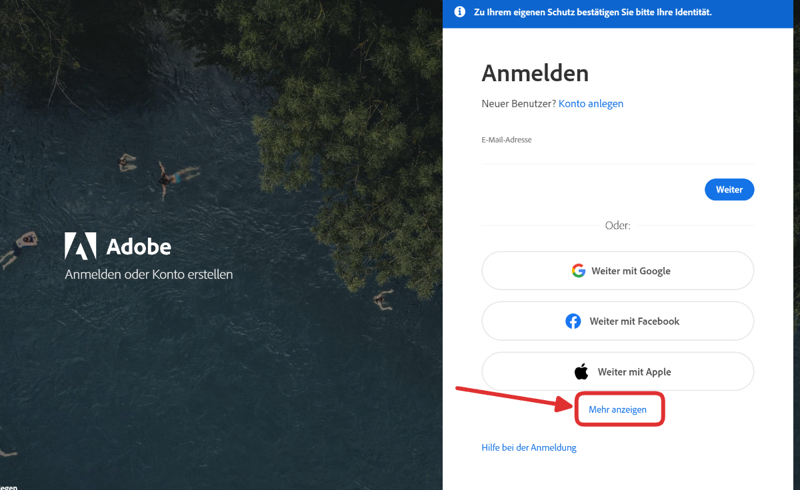

import PageReadCheck from '@tdev/page-read-check/PageReadCheck';

# Adobe Programme
Mit Ihrer Schul-E-Mail-Adresse haben Sie eine Lizenz für die Programmsuite von Adobe und können damit unter anderem:
- PDFs bearbeiten
- Fotos bearbeiten
- Filme schneiden

Für die Installation der Adobe Programme, gehen Sie auf [https://account.adobe.com/](https://account.adobe.com/), klicken Sie auf __Mehr anzeigen__ und danach auf __Weiter mit Microsoft__, und melden Sie sich schliesslich mit Ihrem Schulkonto an.

:::tip[Photoshop]
Wenn Sie das Kunst- oder Schwerpunktfach _Bildnerisches Gestalten_ gewählt haben, installieren Sie Photoshop.
:::

---

<PageReadCheck id="12b9b47e-d51b-441d-bcbd-d9f79b8439b4" />