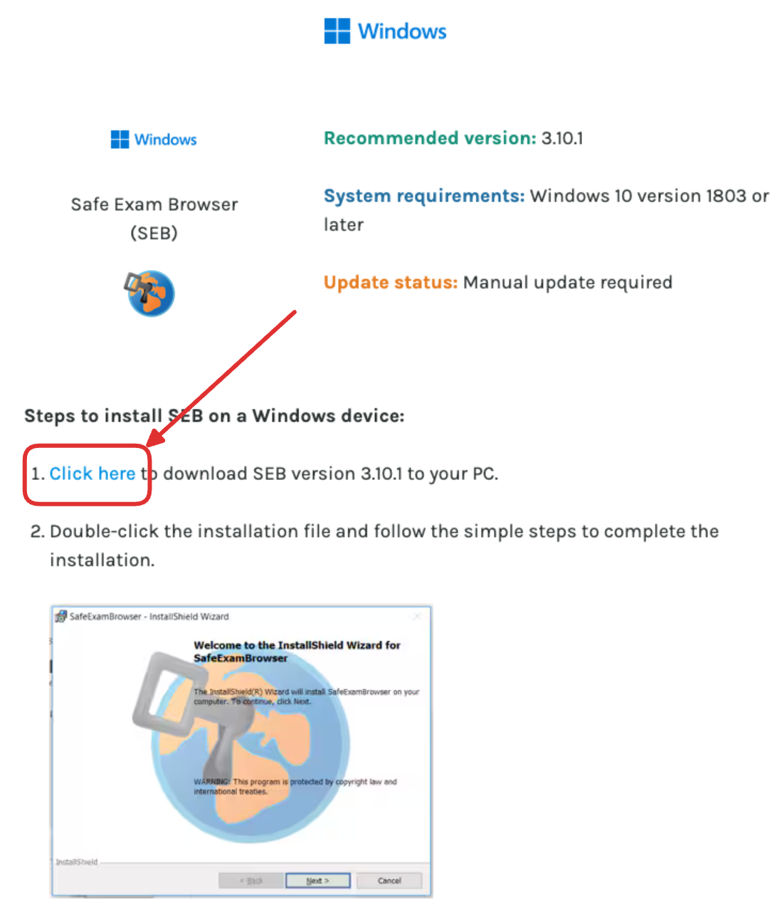
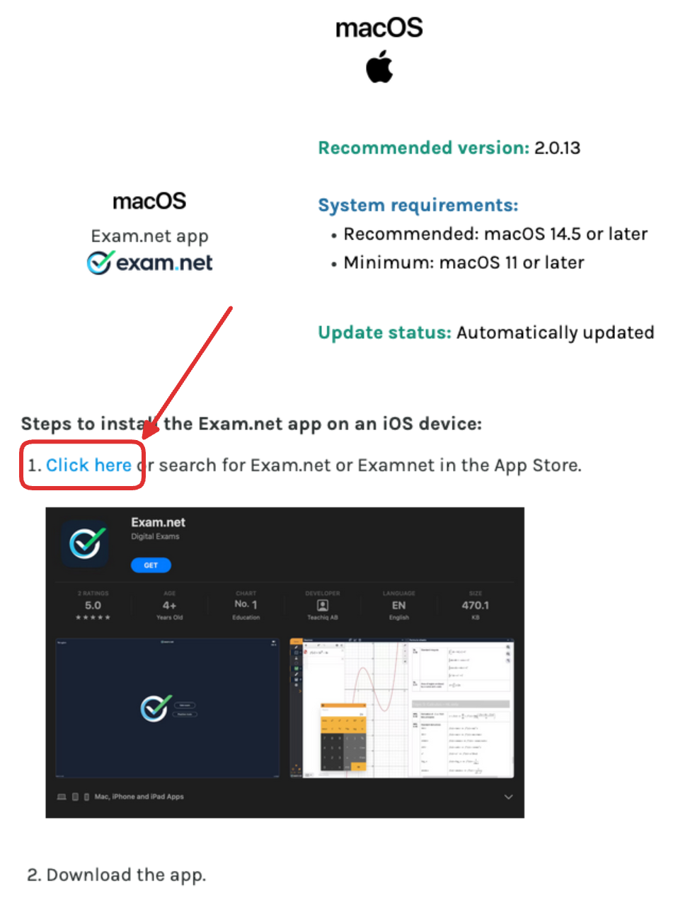

import PageReadCheck from '@tdev/page-read-check/PageReadCheck';
import ProgressState from '@tdev-components/documents/ProgressState';

# Digitales Prüfen
An unserer Schule werden Proben und Abschlussprüfungen zunehmend digital mit Exam.net durchgeführt. Den genauen Ablauf einer Prüfung über Exam.net werden Sie in den ersten Schulwochen vor Ort kennenlernen. Mit dieser Anleitung richten Sie Ihren Computer aber bereits vorab für den sogenannten **Hochsicherheitsmodus** ein.

<Tabs groupId="os">
    <TabItem value="win" label="Windows">
        <Steps>
            1. Öffnen Sie die [offizielle Download-Seite](https://support.exam.net/s/article/install-high-security-software-seb-exam-net-app-kiosk-app-for-chromebooks?language=en_US#Windowsheader) und laden Sie dort die Windows-Version des _Safe Exam Browsers (SEB)_ herunter.
               
            2. Finden Sie die heruntergeladene Datei im Downloads-Ordner und führen Sie sie aus (Doppelklick)
            3. Folgen Sie den Anweisungen des Installationsprogramms.
            4. Löschen Sie die Installationsdatei aus dem Downloads-Ordner.
        </Steps>
    </TabItem>
    <TabItem value="osx" label="macOS + iPad">
        <Steps>
            1. Öffnen Sie die [offizielle Download-Seite](https://support.exam.net/s/article/install-high-security-software-seb-exam-net-app-kiosk-app-for-chromebooks?language=en_US#macOSheader) und klicken Sie auf den Link, um zum entsprechenden App Store Download zu gelangen.
               
        </Steps>
        
    </TabItem>
</Tabs>

:::aufgabe[Exam.net / SEB installiert]
<TaskState id="17fc10b9-c327-43de-a9fc-b7ef5e97632a" />
Der Safe Exam Browser (Windows) bzw. die _Exam.net App_ (macOS) ist auf meinem Computer installiert.
:::

---

<PageReadCheck id="da86af82-83a0-419b-a125-2ef322be86f0" />