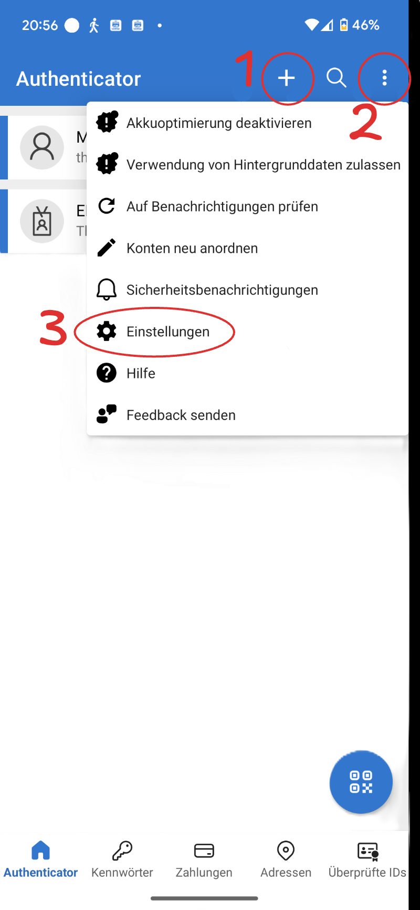
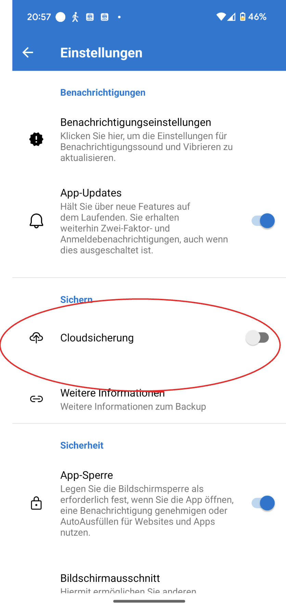

<Faq>
    #### Wie erstelle ich ein Backup meiner Authenticator-App?
    <Solution>
        Falls Sie die Microsoft Authenticator App verwenden, ist es sinnvoll, davon ein Backup zu erstellen. So vermeiden Sie Probleme bei einem Verlust, Defekt oder Wechsel des Smartphones.

        <Steps>
            1. Öffnen Sie die Authenticator-App auf Ihrem Smartphone.
            2. Fügen Sie ein private Microsoft-Konto hinzu. Falls Sie noch keines haben, erstellen Sie eines __+__ (1).
               
            3. Klicken Sie auf __⋮__ (2) und danach auf __Einstellungen__ (3).
            4. Aktivieren Sie die __Cloudsicherung__, damit Ihre Authenticator-Daten in Ihrem privaten Microsoft-Konto gesichert werden.
               
        </Steps>

        Hier finden Sie ausführliche Anleitung von Microsoft für iPhones und Android-Phones: [support.microsoft.com](https://support.microsoft.com/de-de/account-billing/sichern-von-kontoanmeldeinformationen-in-microsoft-authenticator-bb939936-7a8d-4e88-bc43-49bc1a700a40#ID0EBJ=iOS).
    </Solution>
</Faq>