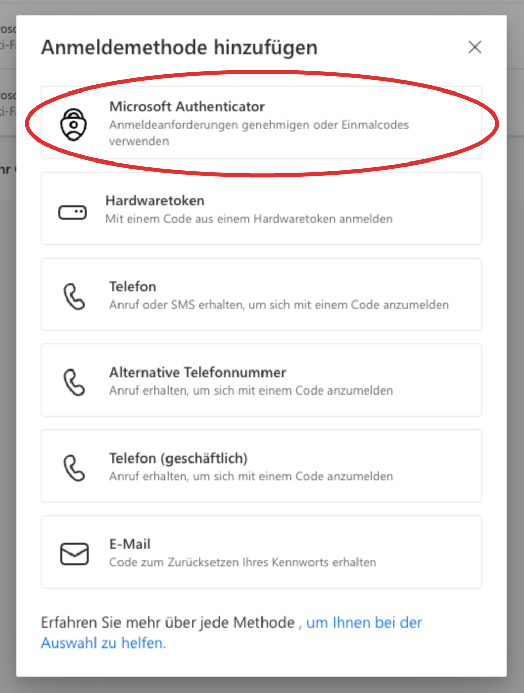
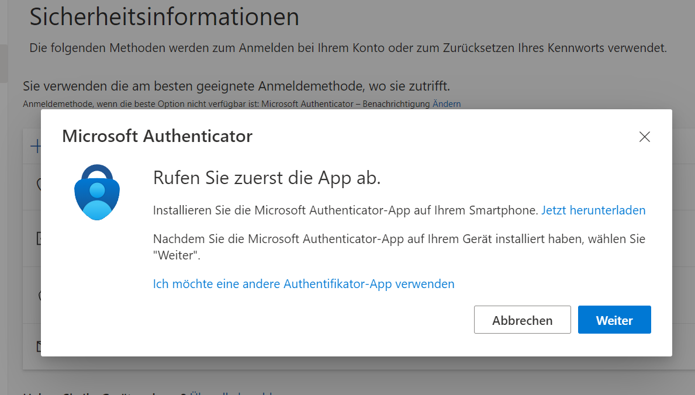
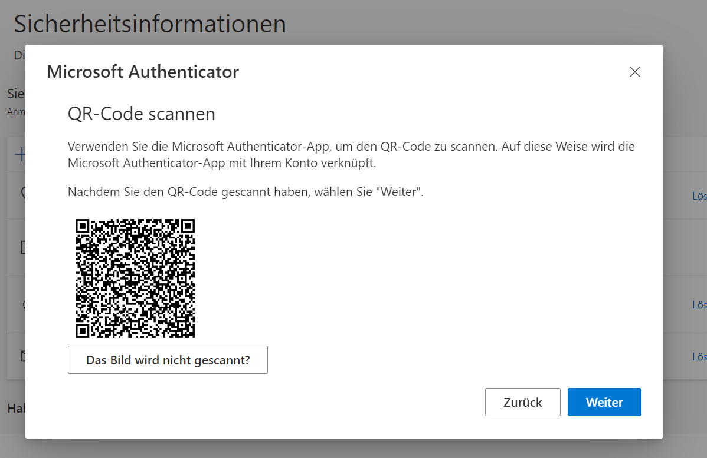

<Faq>
    #### Wie richte ich die Microsoft __Authenticator App__ ein?
    <Solution>
        <Steps>
            1. Öffnen Sie auf dem Laptop folgenden Link: [https://myaccount.microsoft.com/?ref=MeControl](https://myaccount.microsoft.com/?ref=MeControl).
            2. Melden Sie sich mit Ihrem Schulkonto an.
            3. Gehen Sie in Ihrem Konto auf __Sicherheitsinformationen__ und anschliessend auf __Methode hinzufügen__.
               
            4. Wählen Sie die Methode __Microsoft Authenticator__.
               
            5. Folgen Sie den Anweisungen.
               
            6. Fügen Sie Ihr GBSL-Konto hinzu.
               
            7. Zum Schluss erhalten Sie einen QR-Code und folgen dann den weiteren Anweisungen.
               
        </Steps>
    </Solution>
</Faq>