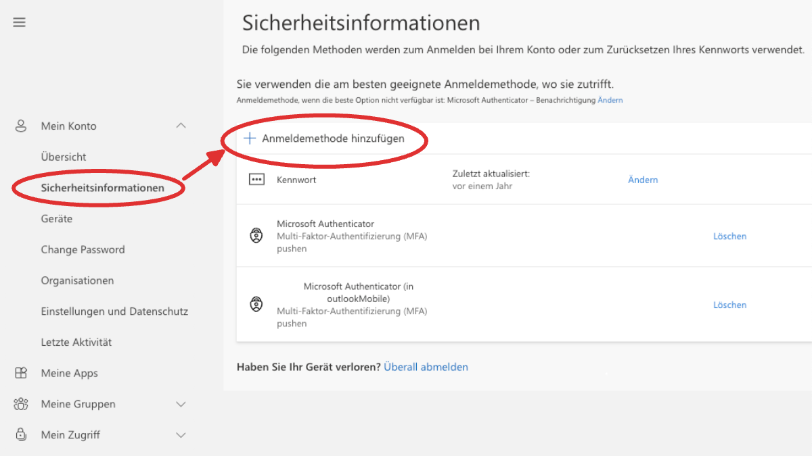
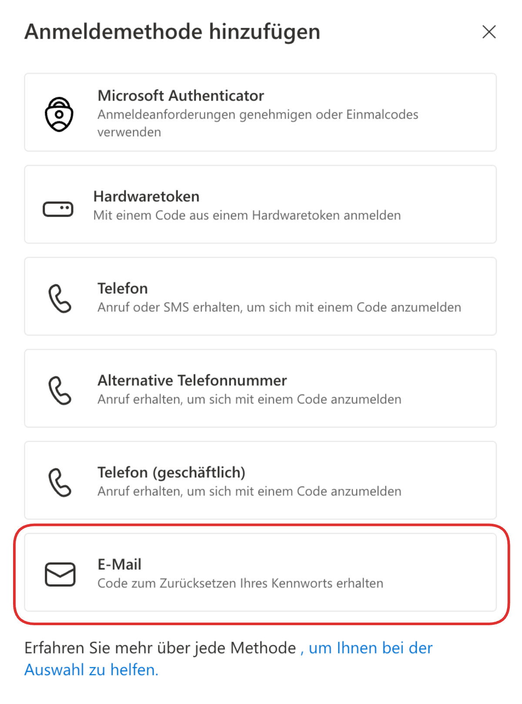
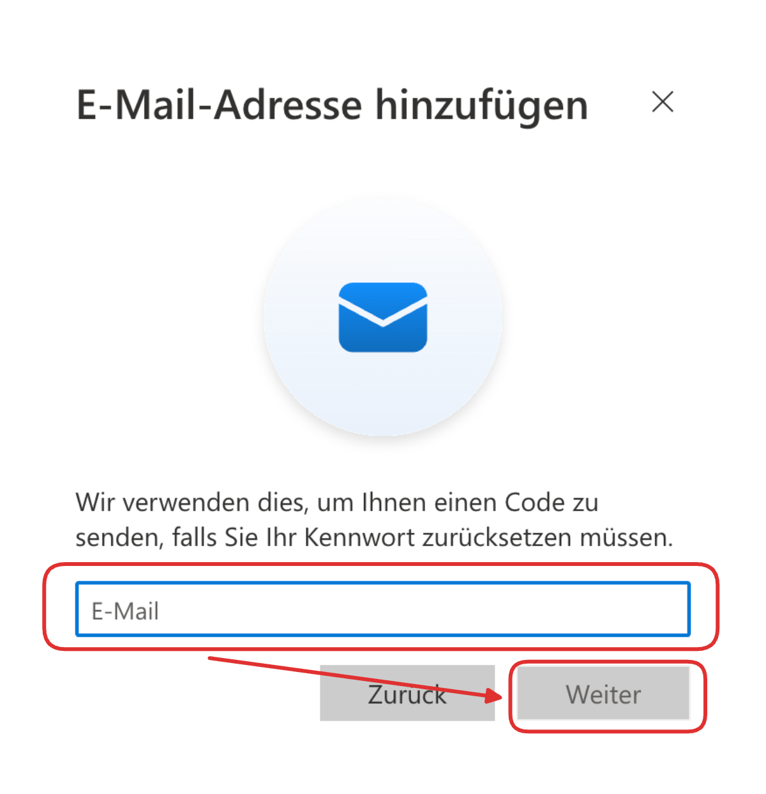

<Faq>
    #### Wie hinterlege ich eine __private E-Mail-Adresse__ als weitere __MFA-Option__?
    <Solution>
        <Steps>
            1. Öffnen Sie auf dem Laptop folgenden Link: [https://myaccount.microsoft.com/?ref=MeControl](https://myaccount.microsoft.com/?ref=MeControl).
            2. Melden Sie sich mit Ihrem Schulkonto an.
            3. Gehen Sie in Ihrem Konto auf __Sicherheitsinformationen__ und anschliessend auf __Methode hinzufügen__.
               
            4. Wählen Sie die Methode __E-Mail__.
               
            5. Geben Sie eine **private, persönliche E-Mail-Adresse** ein, auf die Sie Zugriff haben. Bestätigen Sie mit __Weiter__ und folgen Sie danach den weiteren Anweisungen.
               
        </Steps>
    </Solution>
</Faq>