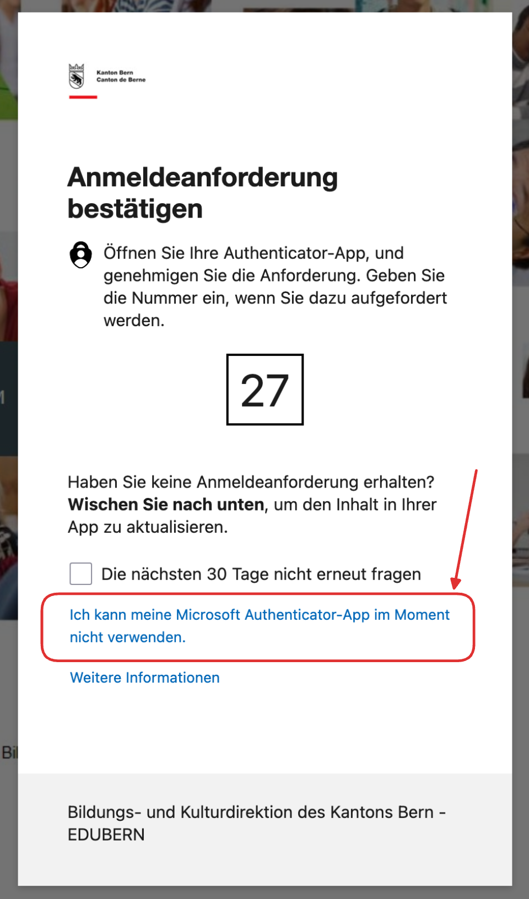

import OfficeAccountReset from '@site/docs/03-support/01-faq/questions/\_office-account-reset.mdx';

<Faq>
    #### Die __Authenticator App__ funktioniert nicht. Was soll ich tun?

    <Solution>
        Falls Sie sich nicht mit der Authenticator App anmelden können, prüfen Sie, ob es mit einer anderen Methode möglich ist:

        

        Sollte dies nicht möglich sein, müssen Sie Ihr Konto zurücksetzen lassen.

        <OfficeAccountReset />
    </Solution>
</Faq>