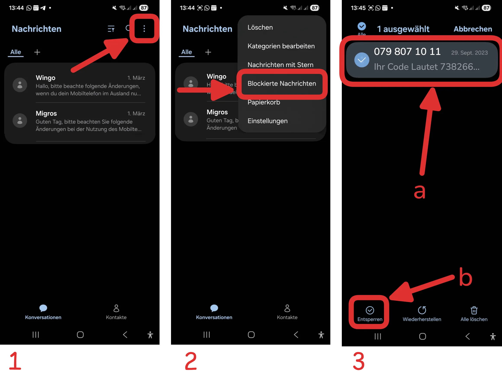
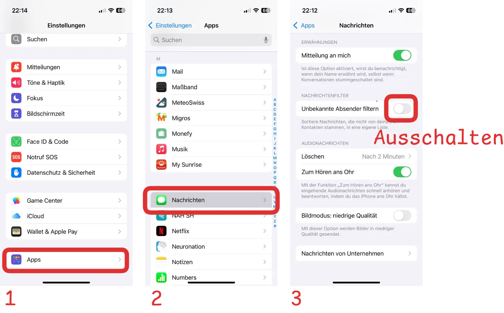
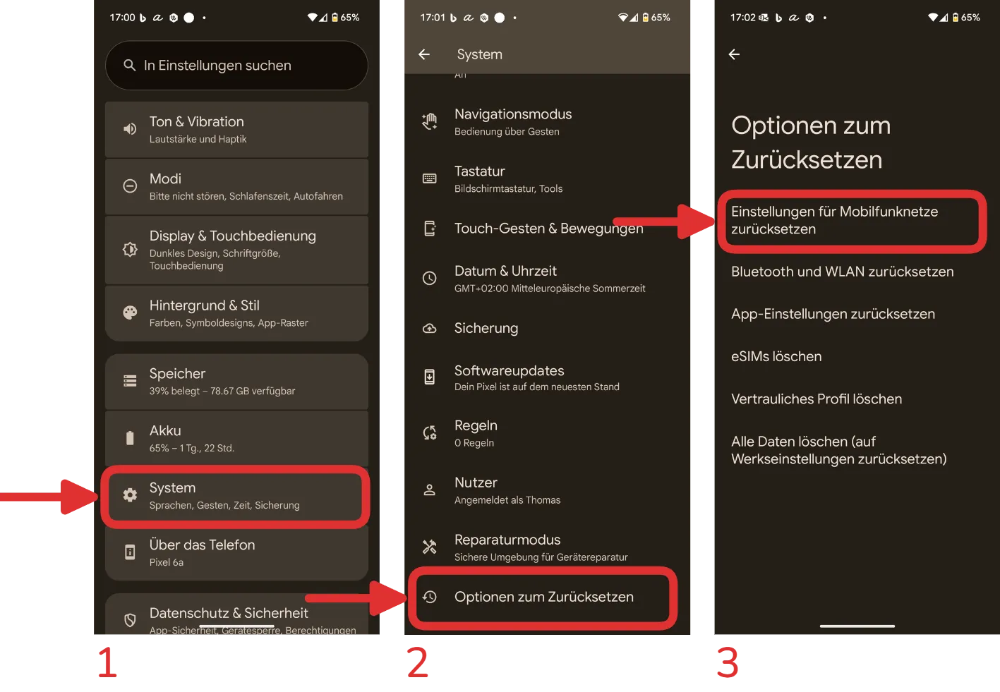
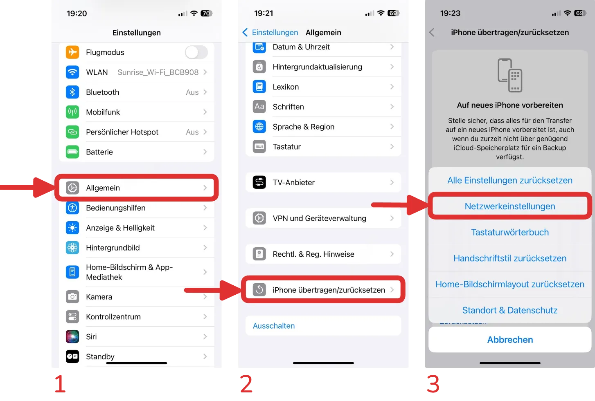

<Faq>
    #### Bei der __Erstanmeldung__ erhalte ich keine SMS. Was soll ich tun?
    <Solution>
        Das kann 2 mögliche Ursachen haben:
        - Ein SMS-Filter verhindert den Empfang.
        - Eine Netzwerk-Einstellung verhindert den Empfang von Nachrichten.

        <Solution title="SMS-Filter überprüfen">
            <Tabs groupId="os" queryString>
                <TabItem value="android" label="Android">
                   Die Bestätigungs-SMS wird von der Nummer __<T id="mfa.sms-sender.phone" />__ gesendet - stellen Sie sicher, dass diese Nummer **nicht blockiert** ist.
                    
                </TabItem>
                <TabItem value="ios" label="iOS">
                    Die Bestätigungs-SMS wird von der Nummer __<T id="mfa.sms-sender.phone" />__ gesendet. Wahlweise können Sie:
                    - den SMS-Filter **vorübergehend deaktivieren**, um die SMS zu empfangen, oder
                    - diese Nummer zu den __Bekannten Absendern__ in Ihrem SMS-Filter hinzufügen.

                    
                </TabItem>
            </Tabs>
        </Solution>
        <Solution title="Netzwerk-Einstellungen zurücksetzen">
            <Tabs groupId="os" queryString>
                <TabItem value="android" label="Android">
                    Navigieren Sie zu __Einstellungen > System > Optionen zurücksetzen > Einstellungen für Mobilfunknetze zurücksetze__ und bestätigen Sie die Aktion. Anschliessend können Sie die Erstanmeldung erneut versuchen.
                    
                </TabItem>
                <TabItem value="ios" label="iOS">
                    Navigieren Sie zu __Einstellungen > Allgemein > iPhone übertragen/zurücksetzen > Netzwerkeinstellungen__ und bestätigen Sie die Aktion. Anschliessend können Sie die Erstanmeldung erneut versuchen.
                    
                </TabItem>
            </Tabs>
        </Solution>
    </Solution>
</Faq>
