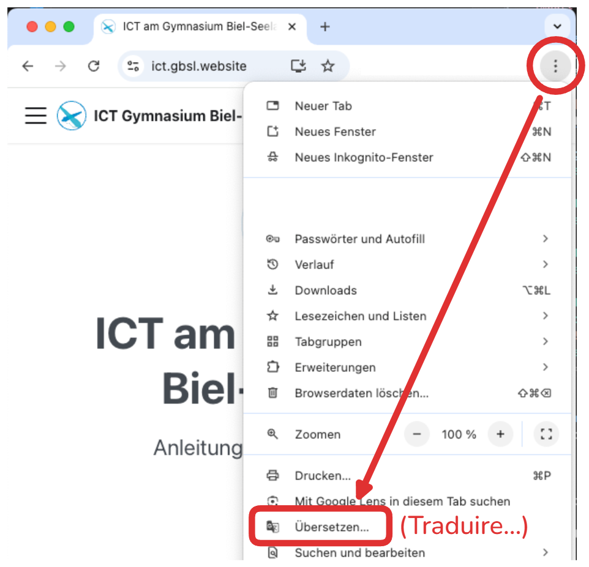
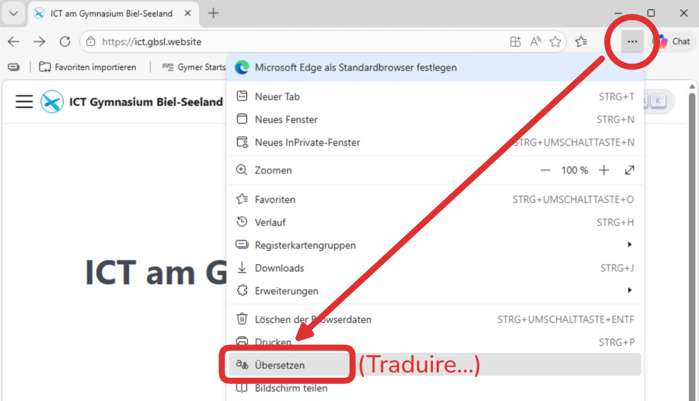
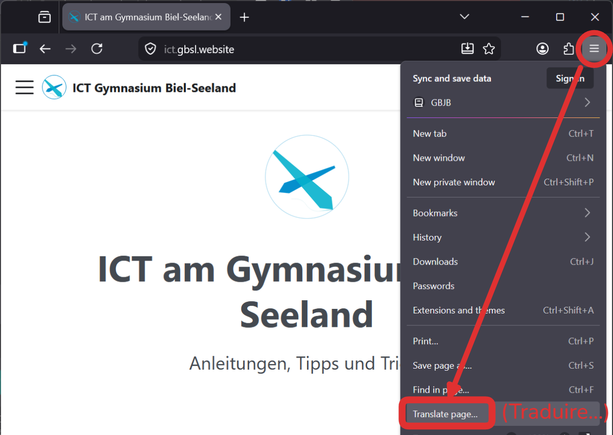
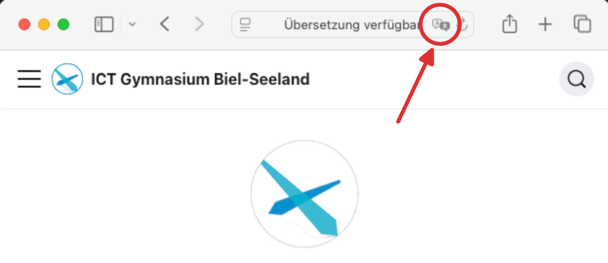

Pour afficher cette page en français, utilisez la fonction de traduction de votre navigateur. Sélectionnez le navigateur correspondant ici et suivez les instructions.

<Tabs groupId="browser">
    <TabItem value="chrome" label="Chrome">
    
    </TabItem>
    <TabItem value="edge" label="Edge">
    
    </TabItem>
    <TabItem value="firefox" label="Firefox">
    
    </TabItem>
    <TabItem value="safari" label="Safari">
    
    </TabItem>
</Tabs>
