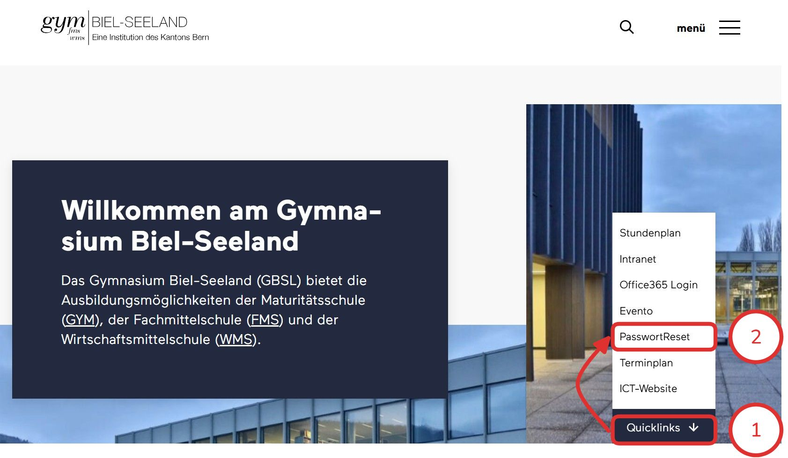
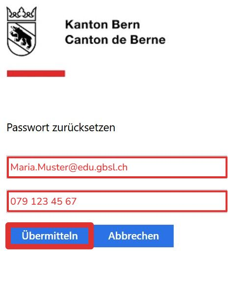

import Badge from '@tdev-components/shared/Badge'
import ProgressState from '@tdev-components/documents/ProgressState';
import PageReadCheck from '@tdev/page-read-check/PageReadCheck';

# Schulkonto

Alle unsere Dienste verwenden ein zentrales Benutzerkonto. Das bedeutet für Sie, dass Sie sich nur **ein einziges Passwort** merken müssen.

Das Schulkonto wird über einen Office-365-Account bereitgestellt und ist für den digitalen Schulalltag die wichtigste Ressource. 

Darüber erhalten Sie Zugang zu:

Mail-Adresse
: Jede Person am GBSL hat eine eigene Mailadresse nach dem Schema
: <Badge color='lightBlue'>{'Vorname.Nachname@gbsl.ch'}</Badge> Angestellte
: <Badge color='blue'>{'Vorname.Nachname@edu.gbsl.ch'}</Badge> für Schüler:innen.
Office 365
: Zugang zu allen Office-Programmen (Word, Excel, PowerPoint, OneNote, Teams, etc.).
Teams
: Zentrale Plattform für die Kommunikation in Klassen und für die Bereitstellung von Unterrichtsmaterialien.
OneDrive
: umfangreicher Cloud-Speicher (5 TB) für persönliche Dateien.
Weiteres
: Anmeldungen (z.B. Informatik-Webseite), kostenloser Zugang zu diversen Softwareprodukten (z.B. Adobe Creative Cloud, AutoDesk, etc.).

## Ersteinrichtung

<ProgressState id="2909ca8b-e9ac-4095-be87-2402a8d60757" keepPreviousStepsOpen>
1. Auf [gbsl.ch](https://gbsl.ch) auf __Quicklinks > Passwort Reset__ klicken.
    <BrowserWindow href="https://gbsl.ch">
        
    </BrowserWindow>
2. Die Schul-E-Mail-Adresse (bspw. <Badge color='blue'>{'Maria.Muster@edu.gbsl.ch'}</Badge> für Schüler:innen) sowie die  
Mobilnummer (`07x xxx xx xx`) eingeben und auf __Übermitteln__ klicken.
    <BrowserWindow href="https://password.edubern.ch/">
        
    </BrowserWindow>

</ProgressState>

<PageReadCheck id="8100b758-99bf-4528-9227-ae0eedab3401" />
