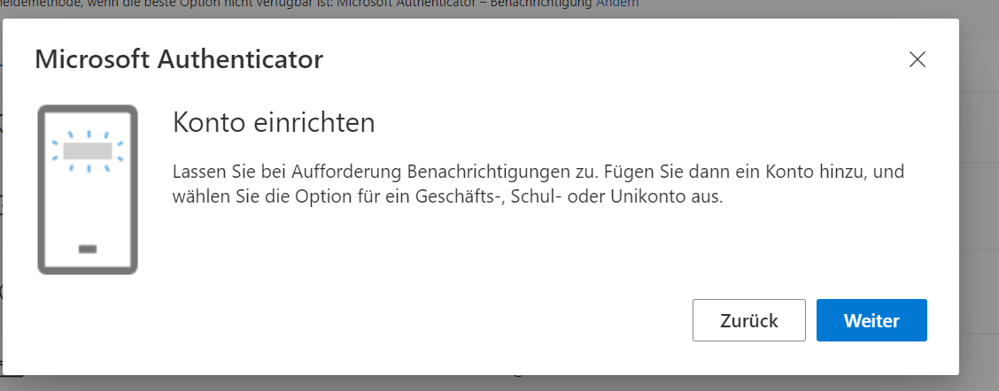

# Wechsel des Smartphones
Falls Sie die Authenticator App verwenden, und Ihr Smartphone defekt ist, verloren gegangen ist oder Sie ein neues Smartphone haben, ist eine Aktion erforderlich.

Dabei kommt es darauf an, ob Sie noch Zugriff auf die Authenticator App auf Ihrem alten Smartphone haben oder nicht. Wählen Sie hier die Option, die auf Ihre Situation zutrifft:

<Tabs groupId="mfa-smartphone-wechsel" queryString>
    <TabItem value="access-possible" label="Authenticator noch zugänglich">
        :::info[Sie haben noch Zugriff auf die alte Authenticator App?]
        Sie haben noch Zugriff auf Ihr altes Smartphone und die Authenticator App funktioniert noch. Dann finden Sie hier eine Anleitung, wie Sie vorgehen können.
        :::

        <Steps>
            1. Öffnen Sie auf dem Laptop folgenden Link: [https://myaccount.microsoft.com/?ref=MeControl](https://myaccount.microsoft.com/?ref=MeControl).
            2. Melden Sie sich wie gewohnt mit Ihrem Schulkonto an.
            3. Gehen Sie in Ihrem Konto auf __Sicherheitsinformationen__ und anschliessend auf __Methode hinzufügen__.
               
            4. Wählen Sie die Methode __Microsoft Authenticator__.
               
            5. Folgen Sie den Anweisungen.
               
            6. Fügen Sie Ihr GBSL-Konto hinzu.
               
            7. Zum Schluss erhalten Sie einen QR-Code und folgen dann den weiteren Anweisungen.
               
        </Steps>

    </TabItem>
    <TabItem value="access-not-possible" label="Authenticator nicht mehr zugänglich">
        :::info[Sie haben keinen Zugriff mehr auf die alte Authenticator App?]
        Sie haben keinen Zugriff mehr auf Ihr altes Smartphone oder die Authenticator App funktioniert nicht mehr? Dann finden Sie hier eine Anleitung, wie Sie vorgehen können.
        :::

        <Steps>
          1. Melden Sie, dass Ihr Konto zurückgesetzt werden muss. Eine E-Mail-Vorlage dazu erhalten Sie [📧 hier](mailto:soarhe.jahany@bernedu.ch?subject=Account%20Sch%C3%BCler%3Ain%20zur%C3%BCcksetzen&body=Guten%20Tag%20Herr%20Jahany%2C%0A%0ABitte%20setzen%20Sie%20meinen%20Account%20zur%C3%BCck%3A%0A%0A%40edu.gbsl.ch%0A%0ATel.%2007%0A%0ABesten%20Dank%20und%20freundliche%20Gr%C3%BCsse). Vergessen Sie nicht, Ihre Mailadresse und Ihre Mobilenummer anzugeben.
          2. Sobald Sie die Meldung erhalten haben, dass Ihr Konto zurückgesetzt worden ist, können Sie den Authenticator auf Ihren neuen Smartphone einrichten oder es bei der Authentifikation via SMS belassen ([vgl.: MFA einrichten](../index.mdx)).
        </Steps>
    </TabItem>
</Tabs>

