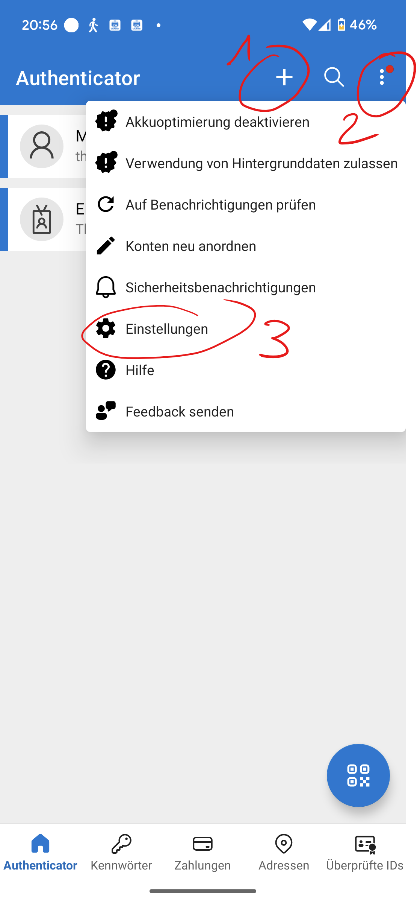
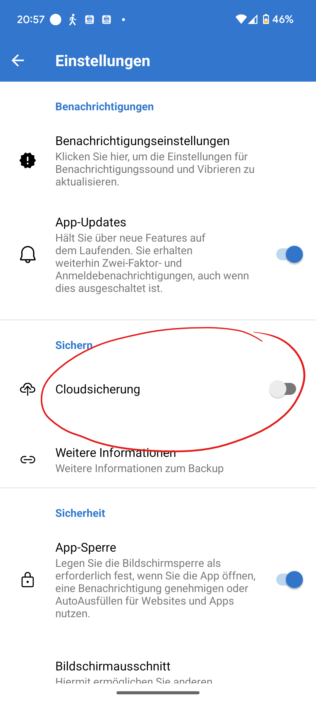

import Badge from '@tdev-components/shared/Badge'
import ProgressState from '@tdev-components/documents/ProgressState';
import PageReadCheck from '@tdev/page-read-check/PageReadCheck';
import FaqMfaReset from '@site/docs/03-support/01-faq/questions/\_mfa-reset.mdx';

# Multi-Faktor-Authentifikation

:::details[Was ist MFA?]
Eine "Multi-Faktor-Authentifizierung" (kurz _MFA_) dient der Sicherheit. Wenn man sich mit 2 Faktoren authentifizieren muss, kann bspw. ein gestohlener Laptop nicht dazu verwendet werden, um sich Zutritt zu einem Konto zu verschaffen. Alle Lehrer:innen und Schüler:innen müssen diese einrichten. Wenn Sie im Schulnetz sind, reichen Mailadresse und Passwort, aber sonst müssen Sie sich immer doppelt authentifizieren.
:::

## Anleitung: MFA einrichten 
<ProgressState id="b9c0df71-8001-4846-b54f-5b1463442b8c" keepPreviousStepsOpen confirm float="right">
1. Im Browser folgenden Link öffnen: [https://aka.ms/mfasetup](https://aka.ms/mfasetup)
2. Es erscheint die Aufforderung zur Eingabe der E-Mail-Adresse (Benutzernamen). Geben Sie hier Ihre **Schul**-E-Mail-Adresse (__Vorname.Name@edu.gbsl.ch__) ein und bestätigen Sie mit __Weiter__.
   
3. Geben Sie das Passwort für Ihr Schulkonto ein und klicken Sie auf __Anmelden__.
   
4. Wenn Sie danach einen Code per SMS erhalten, ist die Einrichtung abgeschlossen. In diesem Fall können Sie die Webseite verlassen.
   
   :::danger[Kein Code erhalten?]
   Falls Sie **keinen Code erhalten**, ist die MFA-Einrichtung **noch nicht abgeschlossen**. Suchen Sie unter [Problemlösung](#problemlösungen) nach der passenden Lösung, um das Problem zu beheben. Führen Sie diese Anleitung anschliessend erneut durch.
   :::
</ProgressState>

## Problemlösungen
:::details[Ich erhalte die Meldung "Weitere Informationen erforderlich"]
Sie erhalten diese Meldung, weil Sie Ihrem Konto noch keine Mobiltelefonnummer hinzugefügt haben. Gehen Sie wie folgt vor, um das Problem zu lösen:

<Steps>
    1. Auf __Weiter__ klicken.
       
    2. Die Methode __Authentifizierungstelefon__, das Land des Providers, die Mobiltelefonnummer und die Auswahl __Code per SMS an mich senden__ anwählen. Eingaben mit __Weiter__ bestätigen.
       
    3. Auf das Mobiltelefon mit der soeben angegebenen Mobiltelefonnummer wird eine SMS mit einem Prüfcode (zufällige Zahlenfolge) geschickt.\
       **Hinweis:** Die Bildschirmaufnahme stammt von einem Google-Android-Smartphone. Die Darstellung ist abhängig vom Smartphone-Typ und kann abweichen.
       
    4. Den per SMS erhaltenen Prüfcode im Eingabefeld eingeben und __Überprüfen__ bestätigen.
       
    5. Abschlussmeldung mit __Fertig__ bestätigen.
       
    6. Wiederholen Sie nun die Schritte aus der Hauptanleitung, um die Einrichtung abzuschliessen.
</Steps>
:::

:::danger[Problem mit dem Authenticator]

Wenn du versucht hast den Authenticator einzurichten, aber keinen Code erhältst oder keinen Code auf deinem Smartphone eingeben kannst, so musst du den Account zurücksetzen lassen. Das machst du per Mail, gib darin deine Schulmailadresse an und deine Mobilenummer: [👉 :mdi[emailEditOutline]](mailto:soarhe.jahany@bernedu.ch?subject=Account%20Sch%C3%BCler%3Ain%20zur%C3%BCcksetzen&body=Guten%20Tag%20Herr%20Jahany%2C%0A%0ABitte%20setzen%20Sie%20meinen%20Account%20zur%C3%BCck%3A%0A%0A%40edu.gbsl.ch%0A%0ATel.%2007%0A%0ABesten%20Dank%20und%20freundliche%20Gr%C3%BCsse)
:::

## Tipps und Tricks
:::details[Tipp: Weitere Authentifizierungsmethoden hinzufügen]  
Eine detaillierte Anleitung zur Einrichtung weiterer Authentifizierungsmethoden finden Sie hier: [EDUBERN: MFA einrichten](https://erzbe.sharepoint.com/sites/EDUBERN-Infohub-Hilfsmittel/Lists/Hilfsmittel/Attachments/4/Anleitung%20-%20Einrichten%20MFA%20EDUBERN%20.pdf).
:::

:::details[Tipp: Backup der Authenticator-App erstellen]
Falls Sie die Microsoft Authenticator App verwenden, ist es sinnvoll, davon ein Backup zu erstellen. So vermeiden Sie Probleme bei einem Verlust, Defekt oder Wechsel des Smartphones.

<Steps>
    1. Öffnen Sie die Authenticator-App auf Ihrem Smartphone.
    2. Fügen Sie ein private Microsoft-Konto hinzu. Falls Sie noch keines haben, erstellen Sie eines __+__ (1).
    3. Klicken Sie auf __⋮__ (2) und danach auf __Einstellungen__ (3).
       
    4. Aktivieren Sie die __Cloudsicherung__, damit Ihre Authenticator-Daten in Ihrem privaten Microsoft-Konto gesichert werden.
      
</Steps>

Hier finden Sie ausführliche Anleitung von Microsoft für iPhones und Android-Phones: [support.microsoft.com](https://support.microsoft.com/de-de/account-billing/sichern-von-kontoanmeldeinformationen-in-microsoft-authenticator-bb939936-7a8d-4e88-bc43-49bc1a700a40#ID0EBJ=iOS).
:::

<FaqMfaReset />

---

<PageReadCheck id="8100b758-99bf-4528-9227-ae0eedab3401" />