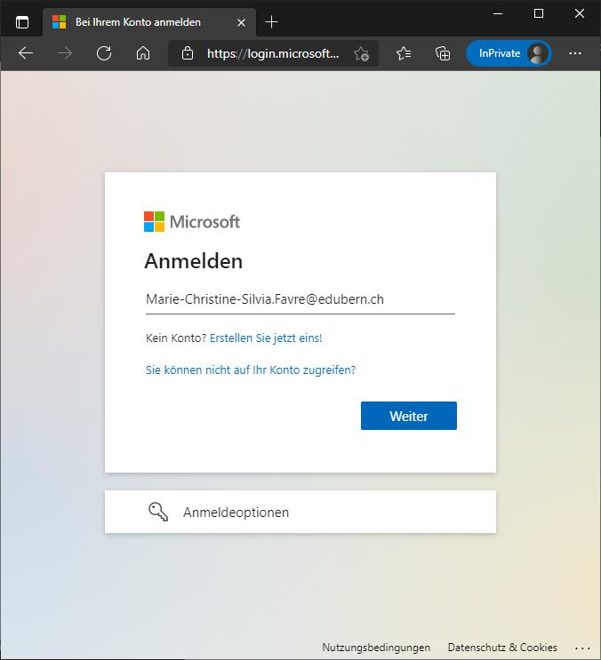
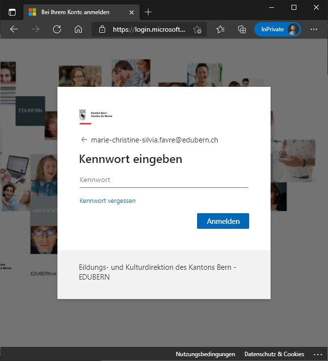
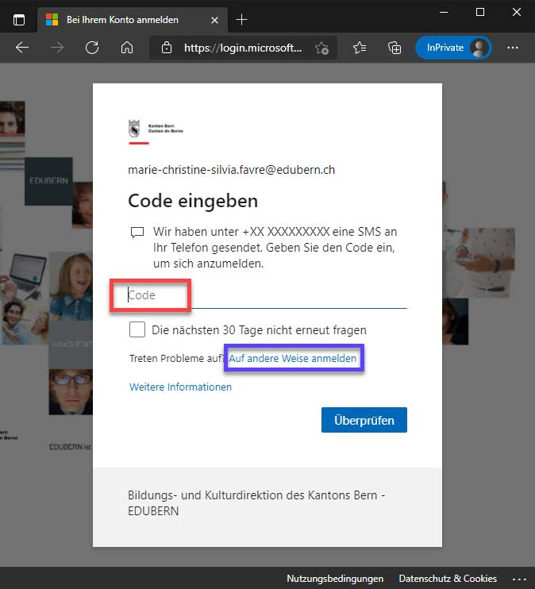
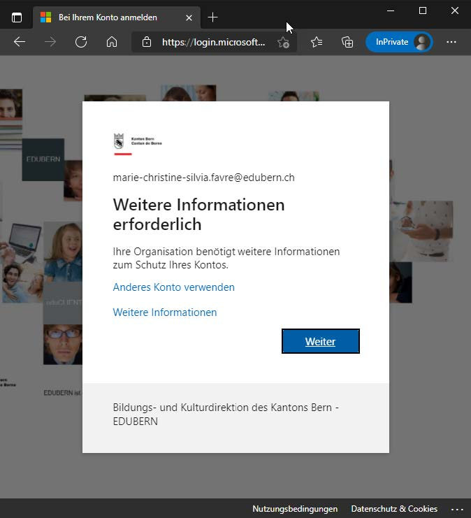
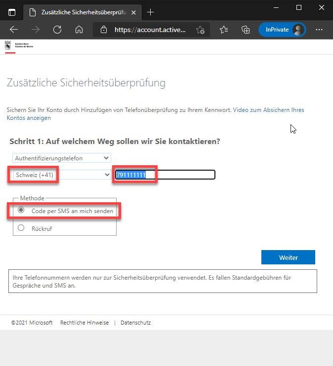
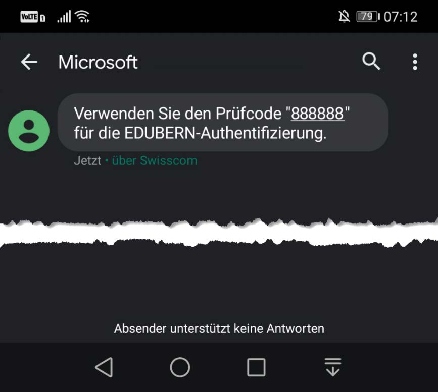
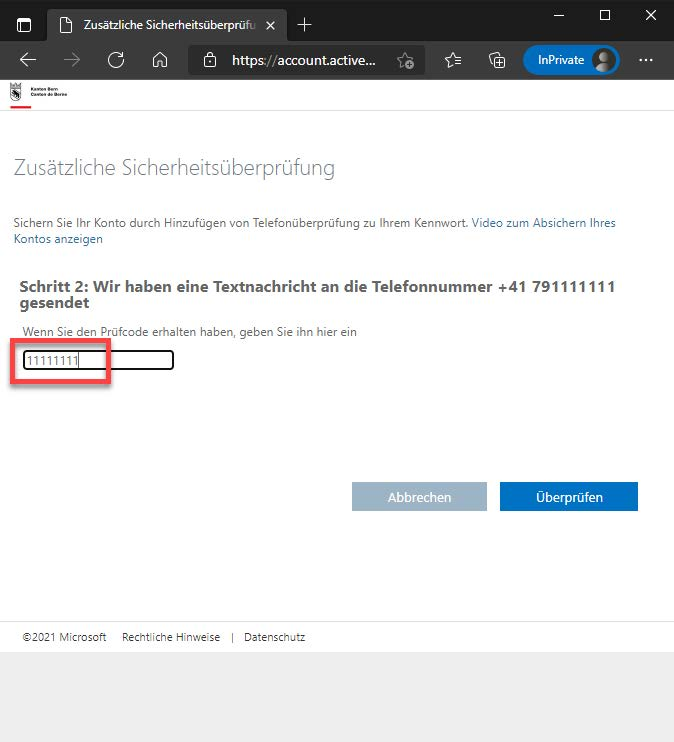
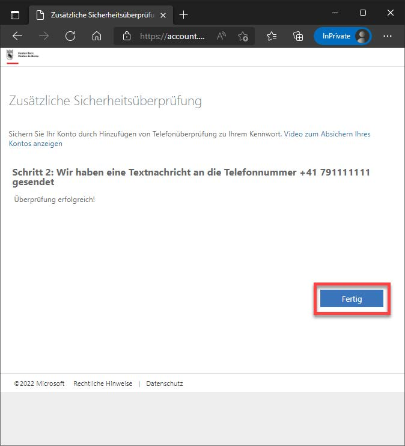

import Badge from '@tdev-components/shared/Badge'
import ProgressState from '@tdev-components/documents/ProgressState';
import PageReadCheck from '@tdev/page-read-check/PageReadCheck';
import FaqMfaReset from '@site/docs/03-support/01-faq/questions/\_mfa-reset.mdx';
import OfficeAccountReset from '@site/docs/03-support/01-faq/questions/\_office-account-reset.mdx';
import MfaWeitereMethoden from '@site/docs/03-support/01-faq/questions/\_mfa-weitere-methoden.mdx';
import AuthenticatorAppBackup from '@site/docs/03-support/01-faq/questions/\_authenticator-app-backup.mdx';

# Multi-Faktor-Authentifikation

:::details[Was ist MFA?]
Eine "Multi-Faktor-Authentifizierung" (kurz _MFA_) dient der Sicherheit. Wenn man sich mit 2 Faktoren authentifizieren muss, kann bspw. ein gestohlener Laptop nicht dazu verwendet werden, um sich Zutritt zu einem Konto zu verschaffen. Alle Lehrer:innen und Schüler:innen müssen diese einrichten. Wenn Sie im Schulnetz sind, reichen Mailadresse und Passwort, aber sonst müssen Sie sich immer doppelt authentifizieren.
:::

## Anleitung: MFA einrichten 
<ProgressState id="b9c0df71-8001-4846-b54f-5b1463442b8c" keepPreviousStepsOpen confirm float="right">
1. Im Browser folgenden Link öffnen: [https://aka.ms/mfasetup](https://aka.ms/mfasetup).
2. Es erscheint die Aufforderung zur Eingabe der E-Mail-Adresse (Benutzernamen). Geben Sie hier Ihre **Schul**-E-Mail-Adresse (__Vorname.Name@edu.gbsl.ch__) ein und bestätigen Sie mit __Weiter__.
   
3. Geben Sie das Passwort für Ihr Schulkonto ein und klicken Sie auf __Anmelden__.
   
4. Wenn Sie danach einen Code per SMS erhalten, ist die Einrichtung abgeschlossen. In diesem Fall können Sie die Webseite verlassen.
   
   :::danger[Kein Code erhalten?]
   Falls Sie **keinen Code erhalten**, ist die MFA-Einrichtung **noch nicht abgeschlossen**. Suchen Sie unter [Problemlösung](#problemlösungen) nach der passenden Lösung, um das Problem zu beheben. Führen Sie diese Anleitung anschliessend erneut durch.
   :::
</ProgressState>

## Problemlösungen

<Faq>
    #### Ich erhalte die Meldung "Weitere Informationen erforderlich"
    <Solution>
        Sie erhalten diese Meldung, weil Sie Ihrem Konto noch keine Mobiltelefonnummer hinzugefügt haben. Gehen Sie wie folgt vor, um das Problem zu lösen:
    
        <Steps>
            1. Auf __Weiter__ klicken.
               
            2. Die Methode __Authentifizierungstelefon__, das Land des Providers, die Mobiltelefonnummer und die Auswahl __Code per SMS an mich senden__ anwählen. Eingaben mit __Weiter__ bestätigen.
               
            3. Auf das Mobiltelefon mit der soeben angegebenen Mobiltelefonnummer wird eine SMS mit einem Prüfcode (zufällige Zahlenfolge) geschickt.\
               **Hinweis:** Die Bildschirmaufnahme stammt von einem Google-Android-Smartphone. Die Darstellung ist abhängig vom Smartphone-Typ und kann abweichen.
            
            4. Den per SMS erhaltenen Prüfcode im Eingabefeld eingeben und __Überprüfen__ bestätigen.
               
            5. Abschlussmeldung mit __Fertig__ bestätigen.
               
            6. Wiederholen Sie nun die Schritte aus der Hauptanleitung, um die Einrichtung abzuschliessen.
        </Steps>
    </Solution>
</Faq>

<OfficeAccountReset />

## Tipps und Tricks
<MfaWeitereMethoden />

<AuthenticatorAppBackup />

<FaqMfaReset />

---

<PageReadCheck id="8100b758-99bf-4528-9227-ae0eedab3401" />