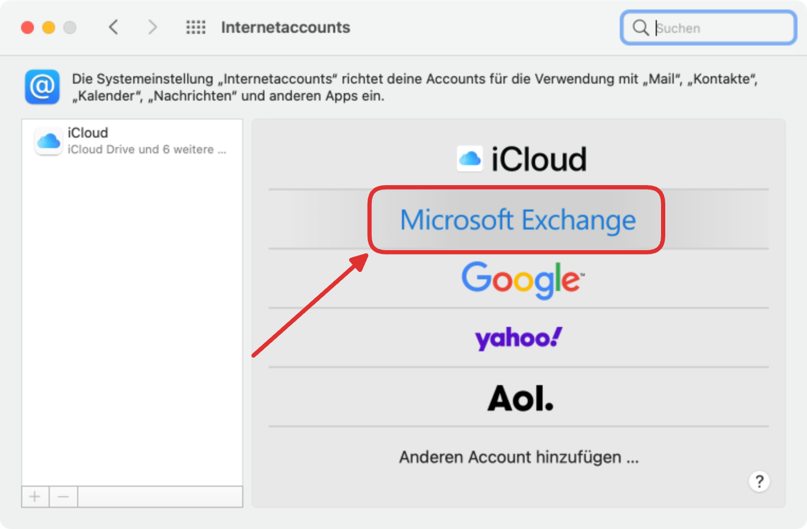
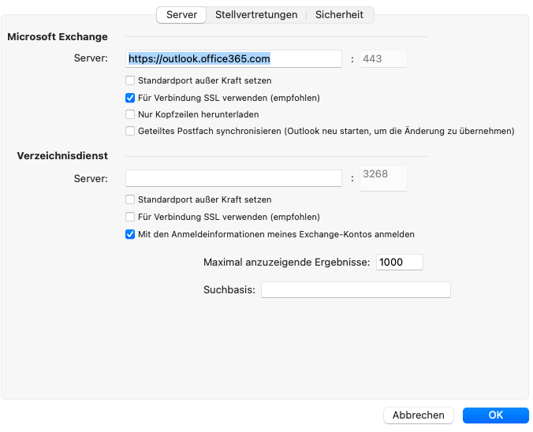
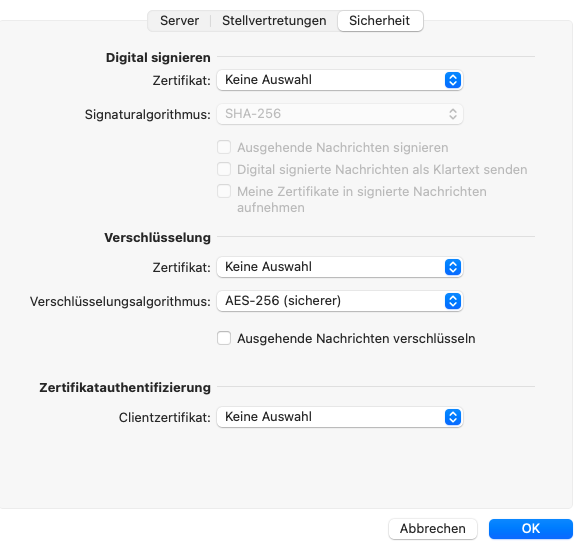
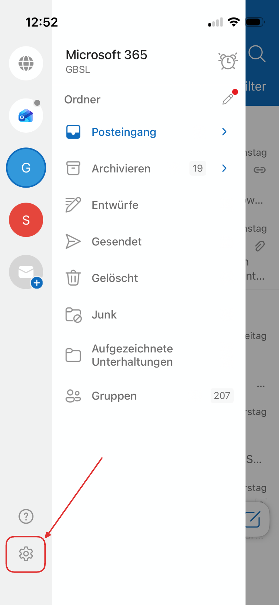
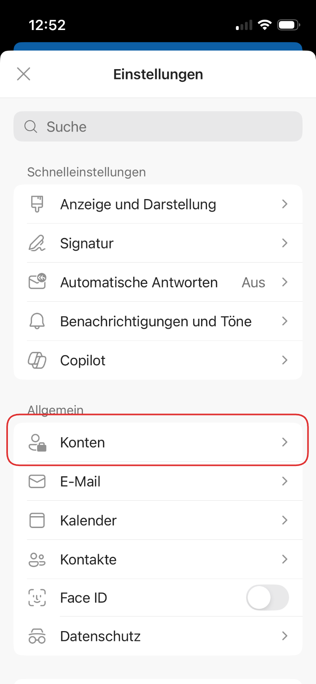
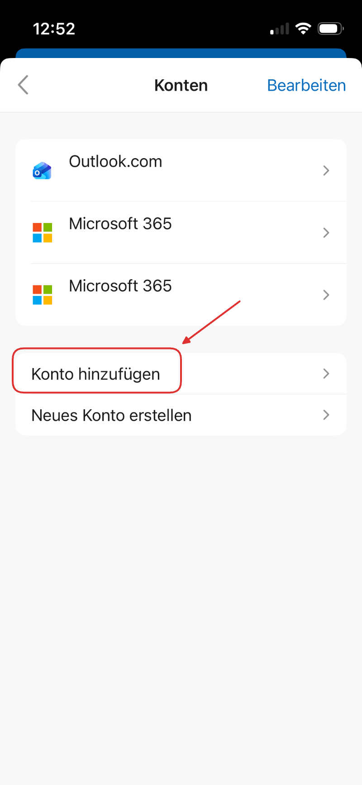
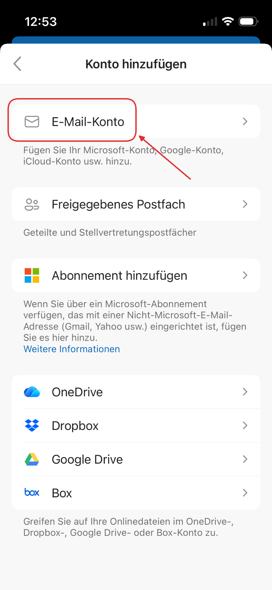
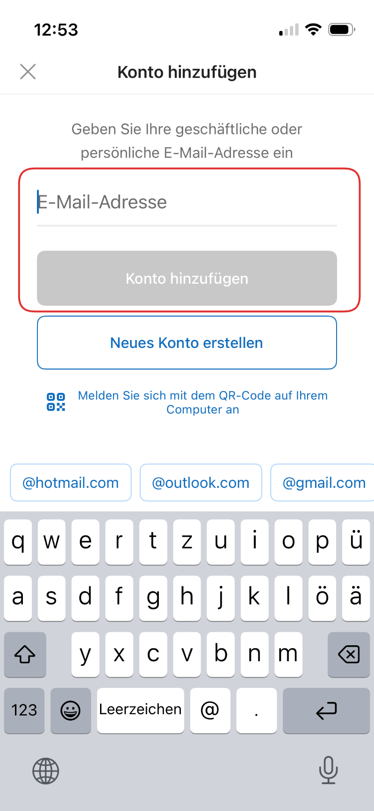

import PageReadCheck from '@tdev/page-read-check/PageReadCheck';

# Mailprogramme einrichten
Die Outlook Web App ist eine einfache Möglichkeit, um schnell auf seine E-Mails zugreifen zu können. Für den täglichen Gebrauch empfiehlt es sich jedoch, auf dem Computer und auf dem Smartphone ein Mailprogramm einzurichten.

Wählen Sie hier das Betriebssystem aus, auf dem Sie ein Mailprogramm einrichten möchten:

<Tabs groupId="os">
  <TabItem value="win" label="Windows">
      Die einfachste Option auf Windows ist die **Outlook** App. Sie ist auf Ihrem Gerät vermutlich bereits vorinstalliert. Wenn Sie Outlook zum ersten Mal starten, wird das Programm Sie nach einer Mailadresse fragen. Geben Sie die Schul-E-Mail-Adresse und das dazugehörige Passwort ein.       
      
  </TabItem>
  <TabItem value="macos" label="macOS">
    <Steps>
        1. Öffnen Sie die __Systemeinstellungen__ und wählen Sie __Internetaccounts__ aus.
        2. Wählen Sie __Microsoft Exchange__ aus.
           
        3. Geben Sie Ihren Namen und Ihre Schul-E-Mail-Adresse ein. Klicken Sie anschliessend auf __Anmelden__.
        4. Kontrollieren Sie die folgenden Einstellungen:
           
           
    </Steps>

    :::tip[Outlook-App]
    Falls Sie auf Ihrem Gerät bereits die Office-Programme installiert haben, können Sie alternativ auch die Outlook-App verwenden.
    :::
  </TabItem>
  <TabItem value="outlook-mobile" label="Smartphone + iPad">
    Auf Ihrem Mobilgerät (Smartphone, iPad) funktioniert die Einrichtung am einfachsten mit der Outlook App.

    <Steps>
        1. Laden Sie die Outlook App aus dem App Store bzw. Google Play Store herunter.
        2. Öffnen Sie die App und klicken Sie unten rechts auf das Zahnrad-Symbol, um die Einstellungen zu öffnen.
           
        3. Klicken Sie auf __Konten__.
           
        4. Klicken Sie auf __Konto hinzufügen__.
           
        5. Klicken Sie auf __E-Mail-Konto__.
           
        6. Geben Sie Ihre Schul-E-Mail-Adresse und danach das dazugehörige Passwort ein. Die restliche Einrichtung erfolgt automatisch.
           
    </Steps>

    :::tip[Standard-App]
    Alternativ können Sie auch die Standard-Mail-App Ihres Geräts verwenden. Die Einrichtung erfolgt ähnlich wie bei der Outlook App. Wenn Sie die Art des E-Mail-Kontos auswählen müssen, wählen Sie __Exchange__ oder __Microsoft 365__ aus.
    :::
    </TabItem>
</Tabs>

---

<PageReadCheck id="05e70fb7-7346-4f21-93ea-0663da1e6028" />