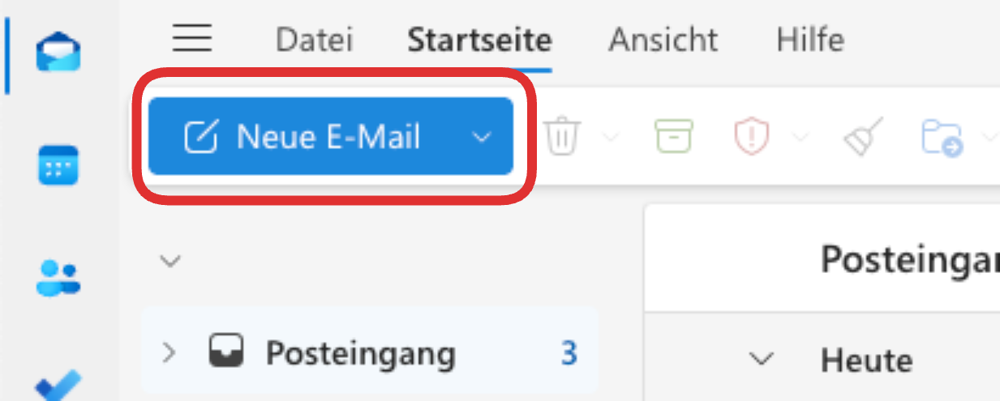
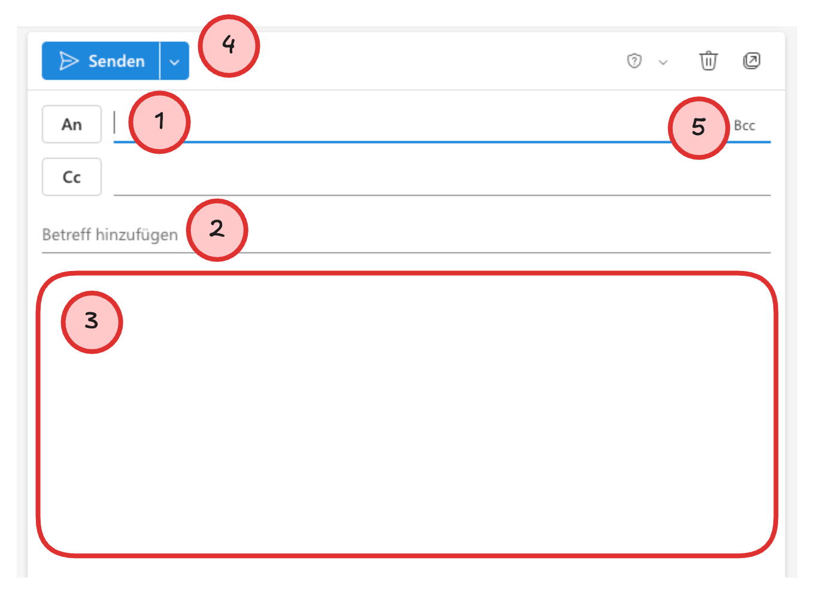
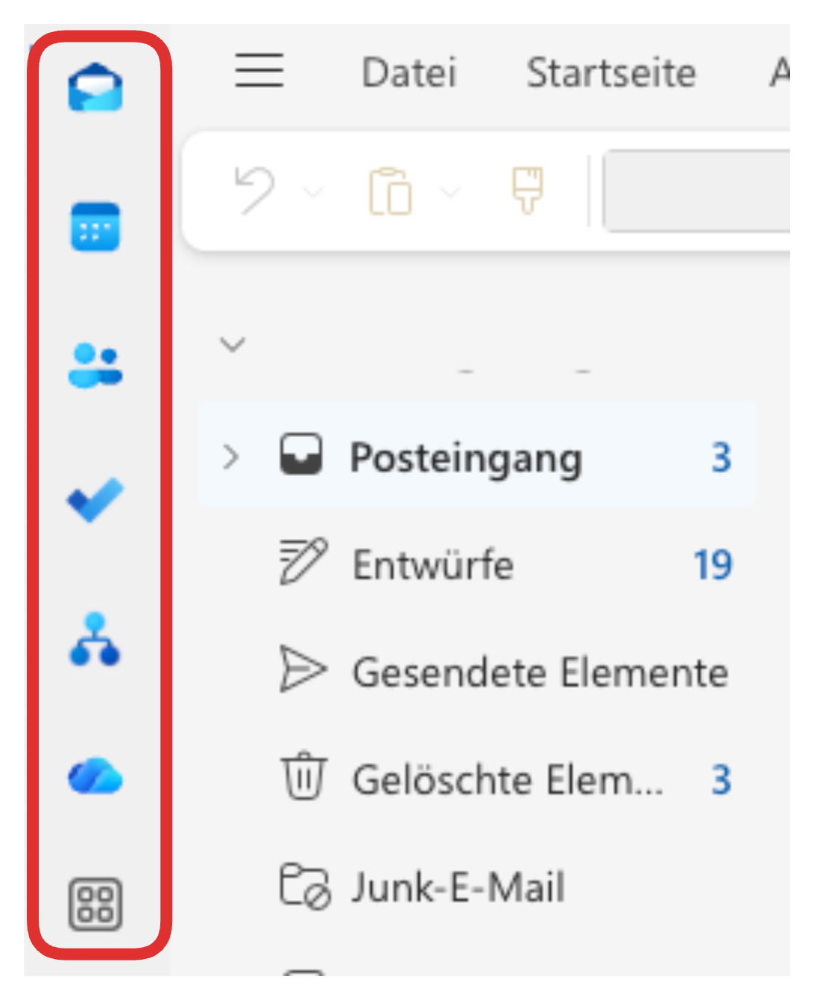

import PageReadCheck from '@tdev/page-read-check/PageReadCheck';

# E-Mail
:::warning[Mails regelmässig prüfen]
Ein Grossteil der Kommunikation an unserer Schule erfolgt über E-Mail. Es ist daher wichtig, dass Sie Ihr E-Mail-Konto regelmässig prüfen - am besten mehrmals täglich!
:::

## Outlook Web App
Sie können direkt über den Browser auf Ihr Schul-E-Mail-Konto zugreifen. Gehen Sie dazu auf [https://outlook.office.com/mail/](https://outlook.office.com/mail/) und melden Sie sich mit Ihren Schulkonto an. Sie gelangen so zur **Outlook Web App**.

:::aufgabe[Einloggen]
<TaskState id="883f810e-3629-4262-b7e2-92b6ba1d888b" />
Loggen Sie sich in Ihrem Schul-E-Mail-Konto ein, um sicherzustellen, dass alles funktioniert.
:::

## E-Mail schreiben
In der Outlook Web App können Sie eine neue E-Mail erstellen, indem Sie oben links auf __Neue E-Mail__ klicken.

Fügen Sie Empfänger:innen :mdi[numeric-1-circle-outline]{.red alt="1"}, Betreff :mdi[numeric-2-circle-outline]{.red alt="2"} und Text :mdi[numeric-3-circle-outline]{.red alt="3"} hinzu. Abschicken können Sie die Nachricht mit einem Klick auf _Senden_ :mdi[numeric-4-circle-outline]{.red alt="4"}.

:::tip[Praktische Tipps]
- Alle E-Mail-Adressen von Schüler:innen, Lehrpersonen und Mitarbeitenden werden beim Tippen automatisch vervollständigt.
- Um das _Bcc_-Feld einzublenden, klicken Sie ganz rechts im __An__-Feld auf __Bcc__ :mdi[numeric-5-circle-outline]{.red alt="5"}. Emfänger:innen im _Bcc_ sehen nicht, wer die E-Mail sonst noch erhalten hat. Das ist immer dann nützlich, wenn Sie eine E-Mail an mehrere Personen versenden wollen, ohne dass Sie dabei die 
E-Mail-Adressen aller Empfänger:innen veröffentlichen möchten.
:::

## Kalender und Kontakte
Outlook bietet neben E-Mail auch weitere Funktionen wie einen Kalender, eine Aufgabenliste und ein Kontaktbuch. Diese Funktionen finden Sie in der Icon-Leiste links oben:

---

<PageReadCheck id="091fb902-d2c2-4e54-bbbc-18ed095506ae" minReadTime={60} />