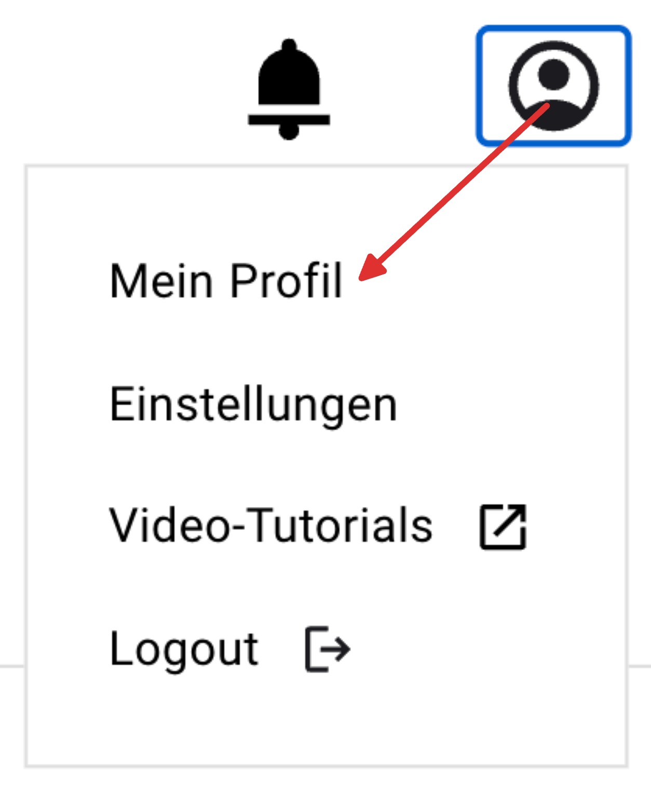
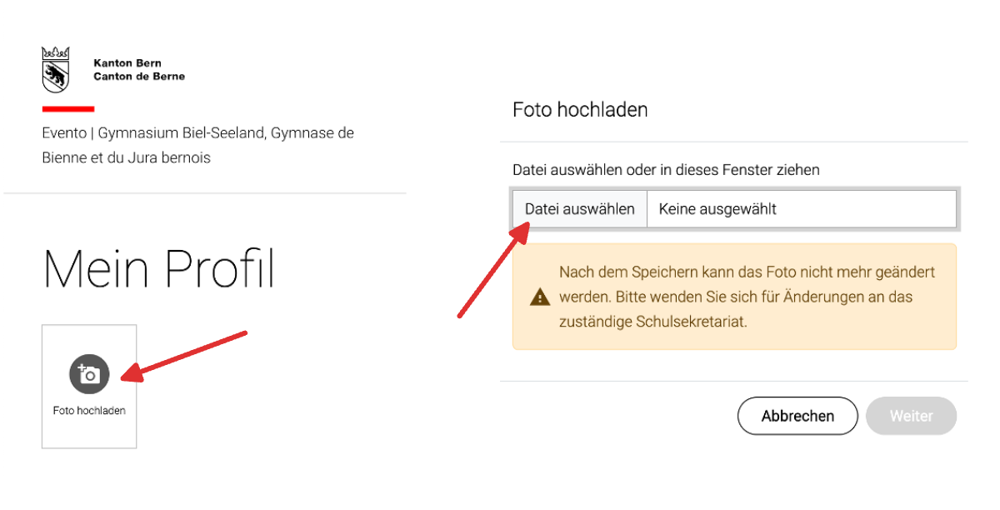
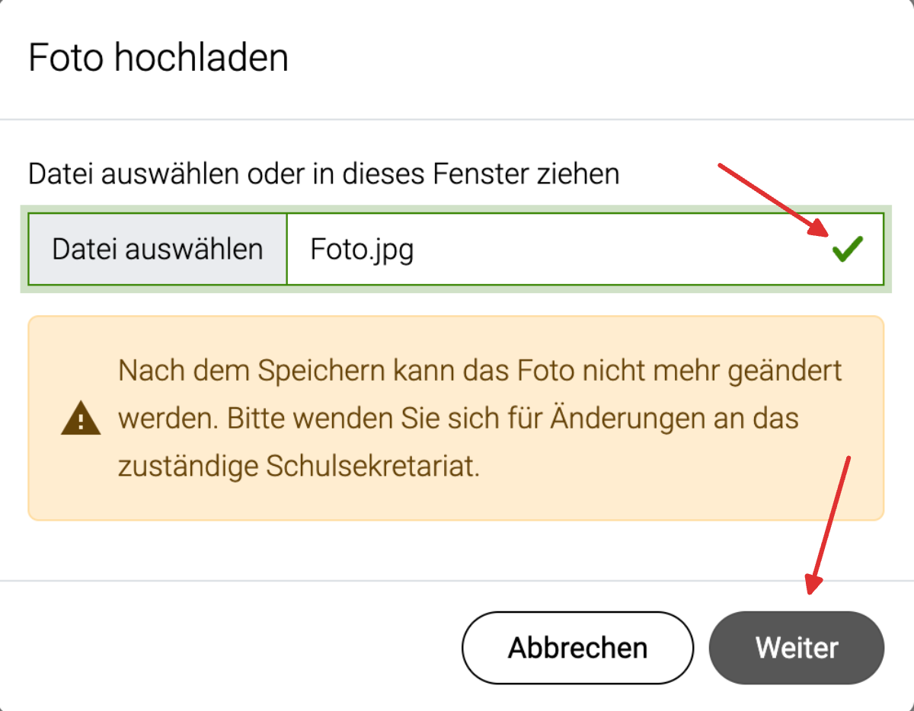
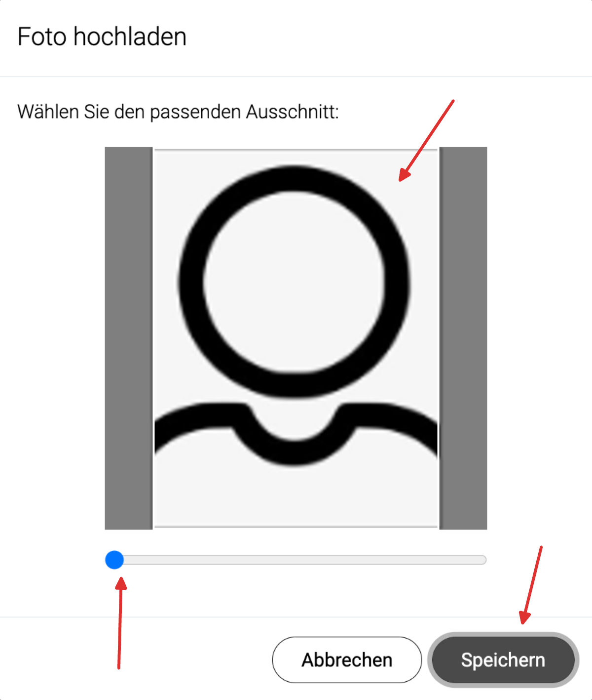

import { translate } from '@docusaurus/Translate';
import ProgressState from '@tdev-components/documents/ProgressState';
import PageReadCheck from '@tdev/page-read-check/PageReadCheck';
import FrageSchuelerausweis from '@tdev-components/MailTemplate/templates/FrageSchuelerausweis';

# Ausweisfoto
Sie erhalten zu Beginn Ihrer Schulzeit am GBSL einen persönlichen Schüler:innenausweis. Damit können Sie:

- Bücher aus der Bibliothek ausleihen
- in der Bibliothek kopieren und drucken, indem sie ein Guthaben auf die Karte laden
- Türen öffnen (gemäss persönlicher Berechtigung, z.B. Musik-Übungsräume, Lift usw.)

**Damit Ihr Ausweis erstellt werden kann, müssen Sie ein aktuelles Passfoto einreichen.** Das Foto wird in der internen Datenbank gespeichert und ist für die Lehrpersonen sichtbar.

## Foto erstellen und hochladen
Das Erstellen und Hochladen des Fotos kann entweder am Smartphone oder am Computer erledigt werden.

<ProgressState id="4cbc6a15-d54b-46f3-9c9f-413f90bf4206" keepPreviousStepsOpen allOpen confirm float="right">
  1. Nehmen Sie (z.B. mit Ihrem Smartphone) ein Foto auf, das folgenden Anforderungen entspricht:
     - Passender Bildausschnitt (siehe Beispielfotos): vollständiges Gesicht, mittig,
     - Blick geradeaus, Augen offen
     - keine Accessoires (z.B. Mützen, Sonnenbrillen)
     - Schärfe: das Gesicht sollte klar erkennbar sein, ohne Unschärfen oder Verzerrungen
     - Neutrale Belichtung: nicht zu dunkel, nicht zu hell
     - Hintergrund: hell, einfarbig
      
     **Beispielfotos:**
     
  2. Gehen Sie auf [https://evt.apps.be.ch](https://evt.apps.be.ch). Wählen Sie als Schule __Gymnasien Biel-Bienne (GBJB/GBSL)__ und melden Sie sich mit Ihrem **Schulkonto** an.

     Klicken Sie dann auf das Personen-Symbol oben links und anschliessend auf __Mein Profil__.

     

  3. Klicken Sie auf __Foto hochladen__ und danach auf __Datei auswählen__.

     

  4. Wählen Sie das Foto, das Sie hochladen möchten, an und kontrollieren Sie, ob ein **grüner Haken** erscheint. Wenn ja, dann klicken Sie auf __Weiter__. Erscheint stattdessen ein rotes Ausrufezeichen, liegt dies am Dateiformat. Der Dateiname muss auf `.png`, `.jpg` oder `.jpeg` enden. Sollte dies nicht der Fall sein, schauen Sie [hier](#bild-konvertieren) nach, wie Sie die Datei konvertieren können.

     

  5. Wählen Sie den passenden Ausschnitt und bestätigen Sie das Hochladen des Bildes, indem Sie auf __Speichern__ klicken. **Wichtig:** Nach dem Speichern kann das Foto nur noch durch das Sekretariat geändert werden! Möchten Sie Ihr Foto ändern, wenden Sie sich bitte an das [Sekretariat](#support).

     

  6. Prüfen Sie zum Schluss, ob das ausgewählte Bild angezeigt wird und keine Fehlermeldung erscheint.
  7. Vergewissern Sie sich, dass Sie alle Schritte als erledigt :mdi[check-circle]{.green} markiert haben:   

     ::video[./images/check-progress-state.mp4]{maxWidth="min(300px,100%)" controls=false autoplay=true loop=true muted=true}
</ProgressState>

    

### Bild konvertieren
Falls Sie ein Foto verwenden möchten, das nicht im `.jpg`-Format vorliegt, können Sie es mit den folgenden Anleitungen in das richtige Format konvertieren.

<Tabs groupId="os">
  <TabItem value="win" label="Windows">
    1. Öffnen Sie das Foto mit der App __Fotos__.
    2. Klicken Sie oben rechts auf die drei Punkte __...__ und wählen Sie __Speichern unter__.
    3. Wählen Sie unter __Dateityp__ das Format `.jpg`.
  </TabItem>
  <TabItem value="macos" label="macOS">    
    1. Öffnen Sie die Fotodatei mit der App __Vorschau__.
    2. Wählen Sie unter __Ablage__ > __Exportieren im Feld __Format__ den Dateityp `JPEG` aus.
  </TabItem>
</Tabs>

## Support
Bei Fragen oder Problemen, melden Sie sich bitte beim Sekretariat:

:mdi[phone]{.blue}
: <TLink id="sekretariat.phone" />
:mdi[email]{.blue}
: <T id="sekretariat.email" />
: <FrageSchuelerausweis />

---

<PageReadCheck id="e4980ba1-1902-4968-85c0-e47fcccac673" minReadTime={1} />