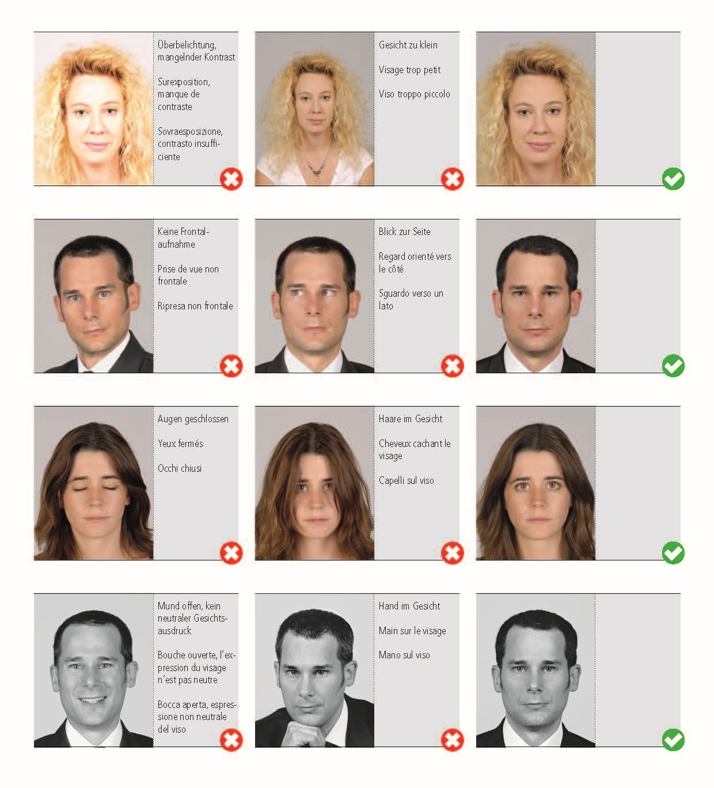
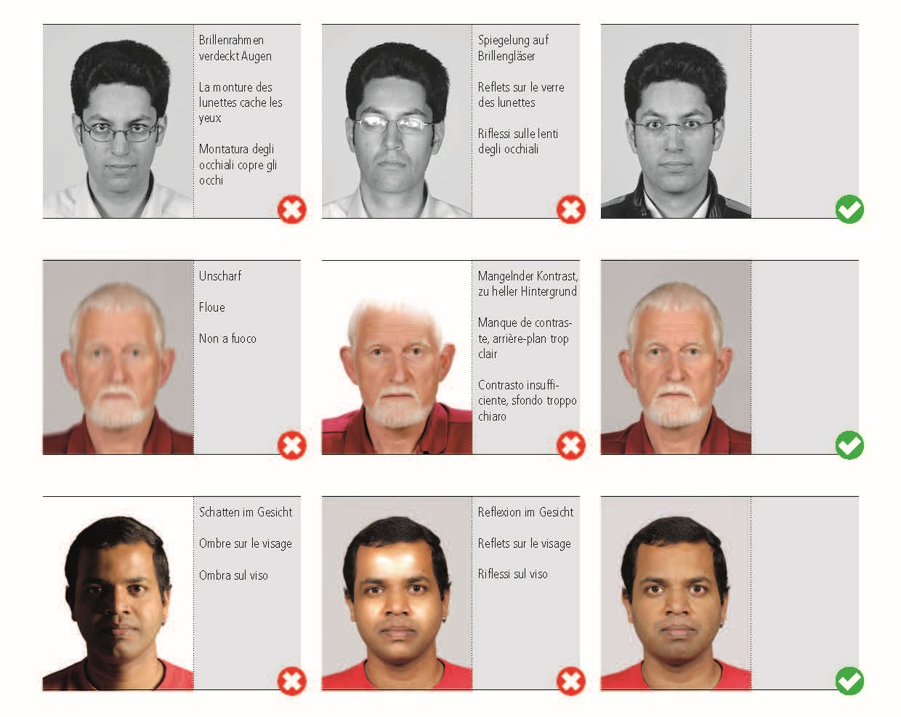
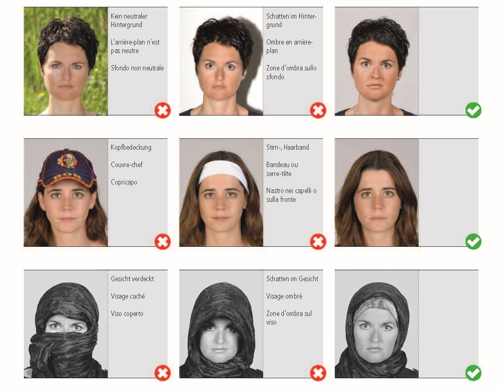
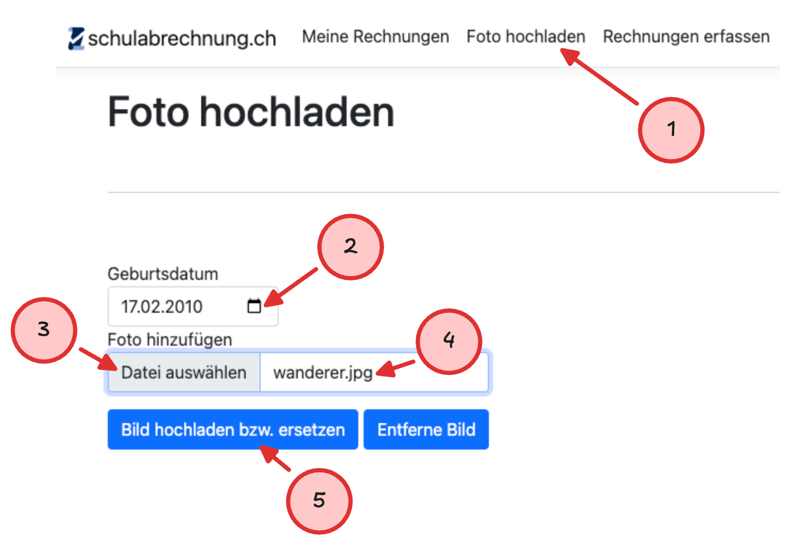
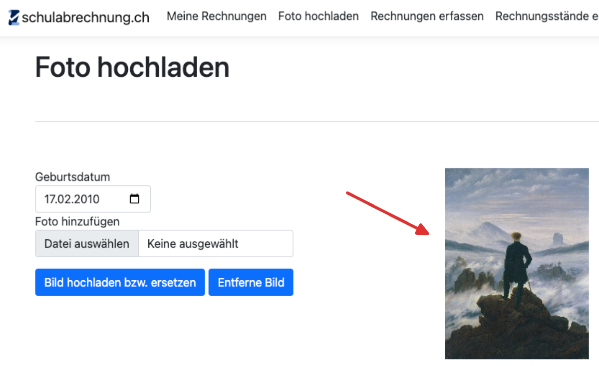

import ProgressState from '@tdev-components/documents/ProgressState';
import PageReadCheck from '@tdev/page-read-check/PageReadCheck';

# Ausweisfoto
Sie erhalten zu Beginn Ihrer Schulzeit am GBSL einen persönlichen Schüler:innenausweis. Damit können Sie:

- Bücher aus der Bibliothek ausleihen
- in der Bibliothek kopieren und drucken, indem sie ein Guthaben auf die Karte laden
- Türen öffnen (gemäss persönlicher Berechtigung, z.B. Musik-Übungsräume, Lift usw.)

**Damit Ihr Ausweis erstellt werden kann, müssen Sie ein aktuelles Passfoto einreichen.** Das Foto wird in der internen Datenbank gespeichert und ist für die Lehrpersonen sichtbar.

## Anforderungen an das Foto
- Passender Bildausschnitt: vollständiges Gesicht, mittig,
- Blick geradeaus, Augen offen
- keine Accessoires (z.B. Mützen, Sonnenbrillen)
- Schärfe: das Gesicht sollte klar erkennbar sein, ohne Unschärfen oder Verzerrungen
- Neutrale Belichtung: nicht zu dunkel, nicht zu hell
- Hintergrund: hell, einfarbig
- **Aktuelles** Foto

    
Beispiele

    

        
        
        
    

## Foto erstellen und hochladen
Das Erstellen und Hochladen des Fotos kann entweder am Smartphone oder am Computer erledigt werden.

<ProgressState id="4cbc6a15-d54b-46f3-9c9f-413f90bf4206" keepPreviousStepsOpen confirm float="right">
    1. Öffnen Sie folgenden Link: [https://schulabrechnung.ch](https://schulabrechnung.ch).
       
    2. Melden Sie sich mit Ihrem **Schulkonto** an.
    3. Klicken Sie oben in der Menüleiste auf __Foto hochladen__ (1).
    4. Wählen Sie Ihr Geburtsdatum aus (2).
    5. Klicken Sie auf auf __Datei auswählen__ (3).
    6. Kontrollieren Sie, ob der Dateiname auf `.jpg` (oder `.jpeg`) endet (4). Sollte dies nicht der Fall sein, schauen Sie [hier](#bild-konvertieren) nach, wie Sie die Datei konvertieren können.
    7. Klicken Sie auf __Bild hochladen bzw. ersetzen__ (5).
    8. Prüfen Sie, ob das ausgewählte Bild angezeigt wird und keine Fehlermeldung erscheint.
       
       
</ProgressState>

### Bild konvertieren
Falls Sie ein Foto verwenden möchten, das nicht im `.jpg`-Format vorliegt, können Sie es mit den folgenden Anleitungen in das richtige Format konvertieren.

<Tabs groupId="os">
  <TabItem value="win" label="Windows">
    1. Öffnen Sie das Foto mit der App __Fotos__.
    2. Klicken Sie oben rechts auf die drei Punkte __...__ und wählen Sie __Speichern unter__.
    3. Wählen Sie unter __Dateityp__ das Format `.jpg`.
  </TabItem>
  <TabItem value="macos" label="macOS">    
    1. Öffnen Sie die Fotodatei mit der App __Vorschau__.
    2. Wählen Sie unter __Ablage__ > __Exportieren im Feld __Format__ den Dateityp `JPEG` aus.
  </TabItem>
</Tabs>

## Support
Bei Fragen oder Problemen, melden Sie sich bitte beim Sekretariat:

📞 **032 327 07 07**

✉️ **[sekretariat@gbsl.ch](mailto:sekretariat@gbsl.ch?subject=Frage%20zum%20Schülerausweis&body=Guten%20Tag%2C%0A%0AIch%20habe%20eine%20kurze%20Frage%20zum%20Schülerausweis:%0A%0AMit%20freundlichen%20Gr%C3%BCssen%0A%5BIhr%20Name%5D)**

---

<PageReadCheck id="e4980ba1-1902-4968-85c0-e47fcccac673" />