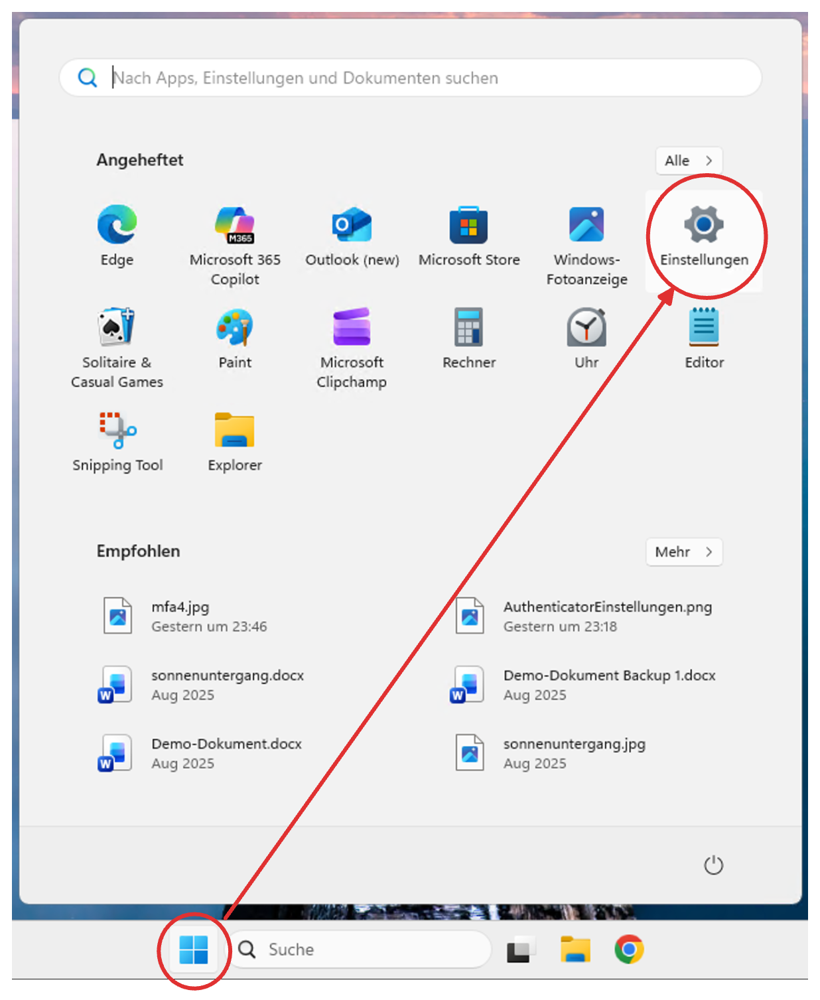
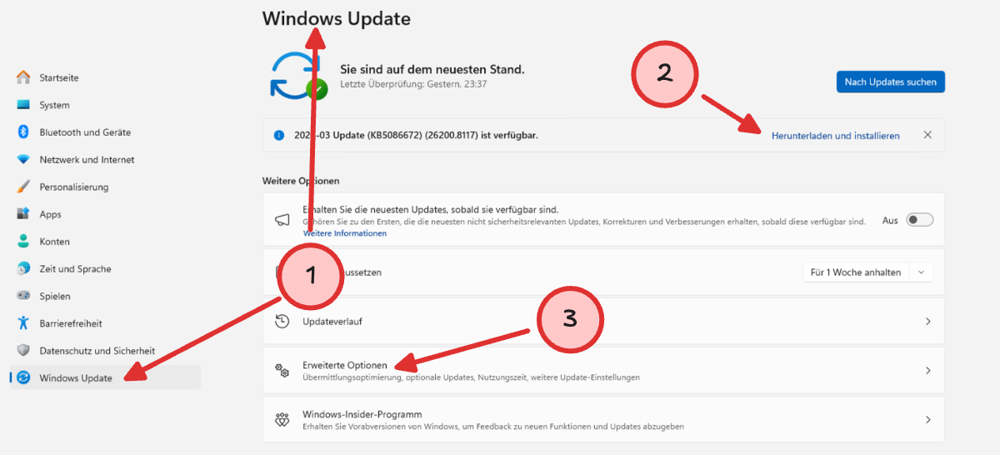
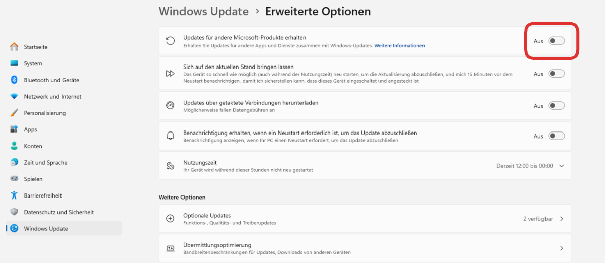
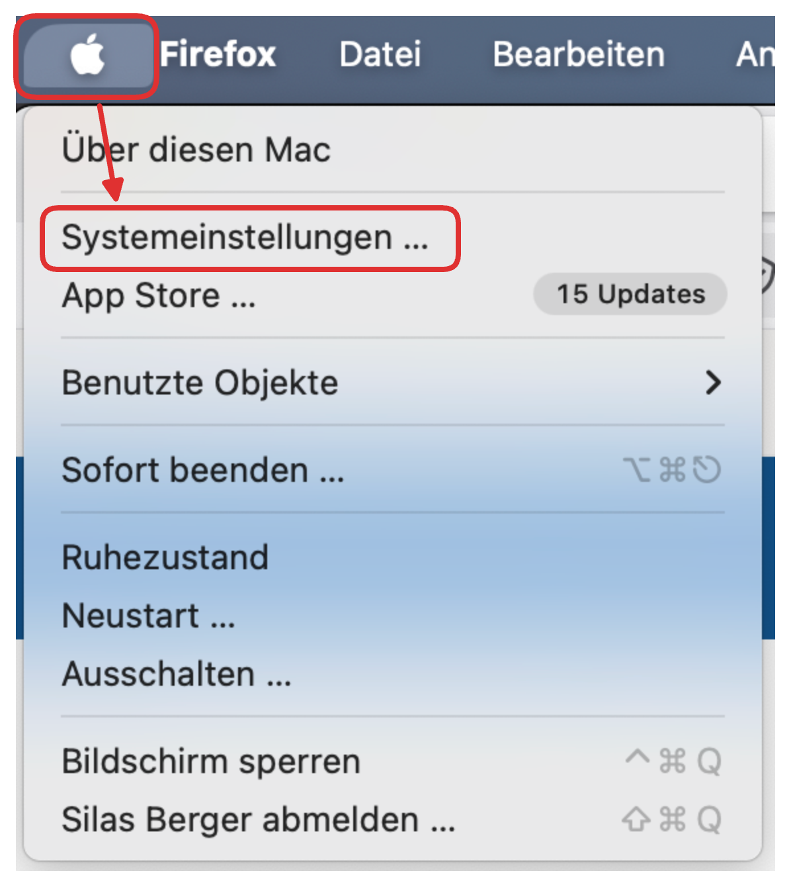
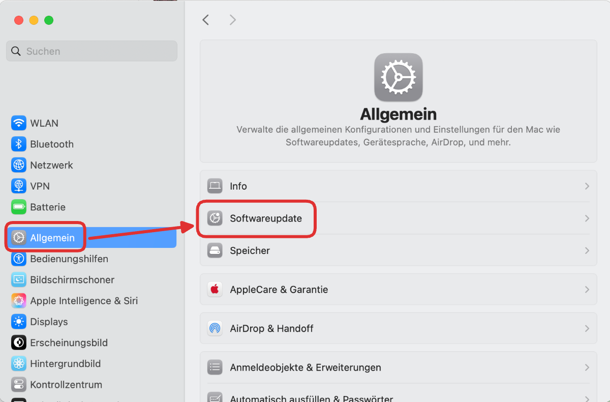
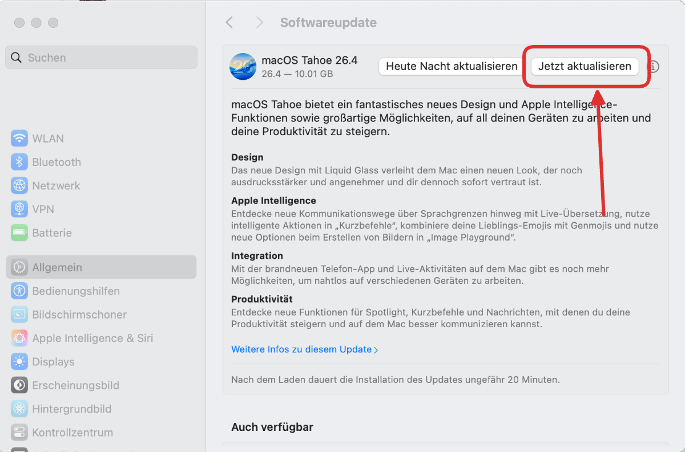
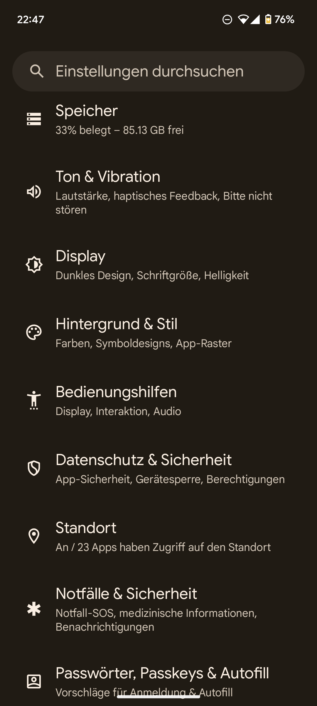
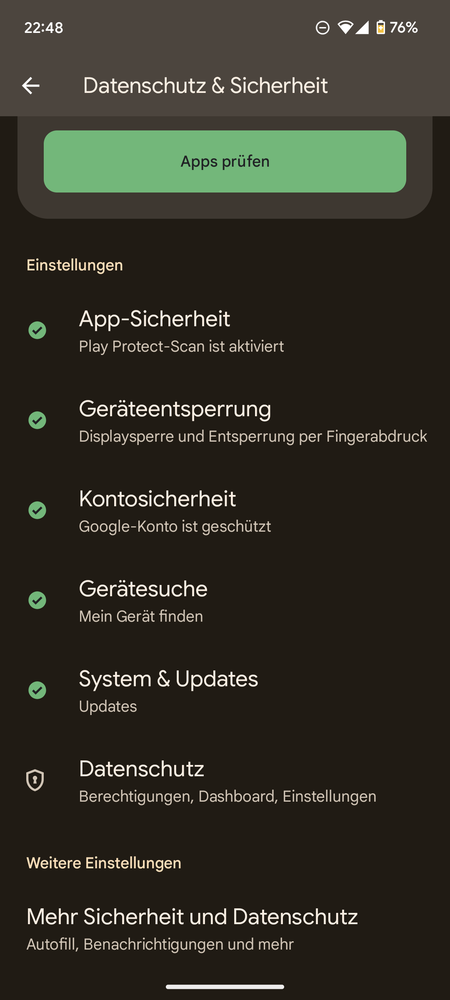
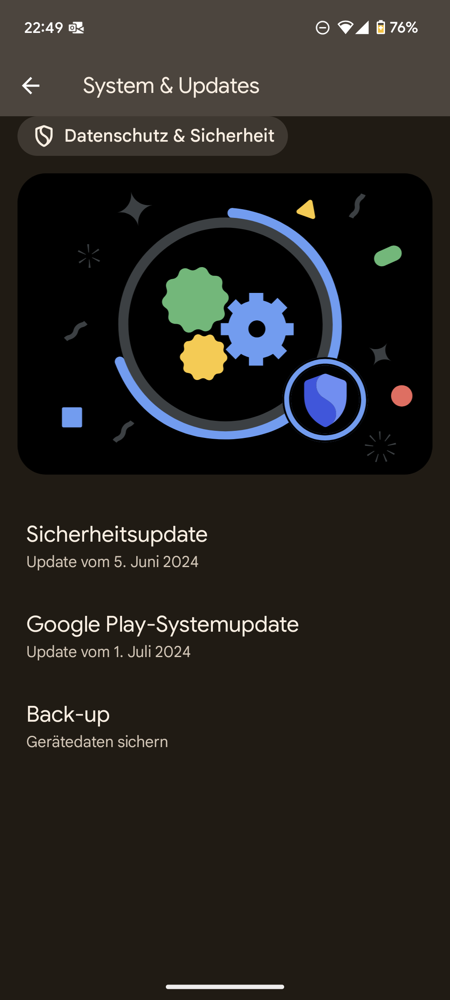

import PageReadCheck from '@tdev/page-read-check/PageReadCheck';

# Updates
Updates sind wichtig, denn damit bleiben Ihr Gerät und Ihre Programme auf dem neusten Stand. Meist erhalten sie Verbesserungen von Fehlern und schliessen auch Sicherheitslöcher. Sie dienen damit dem Schutz Ihres Geräts und Ihrer Dateien.

Wählen Sie hier die passende Anleitung für Ihren Laptop **und** für Ihr Smartphone aus und stellen Sie sicher, dass auf beiden Geräten die neusten Updates installiert sind.

<Tabs groupId="os">
  <TabItem value="win" label="Windows">
    <Steps>
        1. Öffnen Sie die Systemeinstellungen.
           
        2. Gehen Sie auf __Windows Update__ (1). Falls ein Update verfügbar ist, klicken Sie auf __Herunterladen und installieren__ (2). Bleiben Sie auf dieser Seite und prüfen Sie, ob ein Knopf zum Neustart des Computers erscheint. Falls ja, starten Sie den Computer neu. Kehren Sie danach auf diese Seite zurück und prüfen Sie, ob weitere Updates verfügbar sind. Wiederholen Sie diesen Vorgang, bis keine Updates mehr verfügbar sind.
           
        3. **Optional:** Gehen Sie auf __Erweiterte Optionen__ (3 oben). Aktivieren Sie dann die Option __Updates für andere Microsoft-Produkte erhalten__. So werden auch wichtige Updates für andere Microsoft-Programme wie z.B. die Office-Programme installiert.
           
    </Steps>
  </TabItem>

  <TabItem value="macos" label="macOS">
    <Steps>
      1. Öffnen Sie die Systemeinstellungen.
         
      2. Gehen Sie auf __Allgemein__ > __Softwareupdate__.
         
      3. Falls ein Update verfügbar ist, installieren Sie es jetzt gleich. **Achten Sie darauf, dass Ihr MacBook während des Updates an der Stromversorgung angeschlossen ist.**
         
    </Steps>
  </TabItem>

  <TabItem value="ios" label="iOS">
    <Steps>
      1. Öffnen Sie die Einstellungen.
      2. Gehen Sie auf __Allgemein__ > __Softwareupdate__.
      3. Stellen Sie sicher, dass die Option __Automatische Updates__ aktiviert ist, damit Ihr iPhone automatisch die neusten Updates installiert. So erhalten Sie jeweils eine Benachrichtigung, wenn ein Update installiert wurde oder verfügbar ist.
      4. Falls gerade ein Update verfügbar ist, installieren Sie es jetzt gleich.
    </Steps>
  </TabItem>

  <TabItem value="android" label="Android">
    Das genaue Verhalten kann zwischen verschiedenen Android-Versionen und Marken des Smartphones variieren. In der Regel erhalten Sie aber eine Benachrichtigung, wenn ein Update verfügbar ist. Klicken Sie diese an, um das Update zu installieren, falls die Benachrichtigung nicht lediglich darauf hinweist, dass das Update automatisch installiert wird oder bereits installiert wurde.

    Um manuell nach Updates zu suchen, gehen Sie wie folgt vor:
    <Steps>
        1. Öffnen Sie die Einstellungen und wählen Sie __Datenschutz und Sicherheit__ aus.
           
        2. Gehen Sie auf __System und Updates__.
           
        3. Klicken Sie auf __Systemupdate__. Dort sehen Sie, ob es ein Update zu installieren gibt. Falls ja, können Sie es jetzt gleich installieren.
           
    </Steps>
  </TabItem>
</Tabs>

:::aufgabe[Updates installiert]
<TaskState id="41c5ed71-65b5-4c74-9dd4-02ebc9f0a004" />
Ich habe die neusten Updates auf meinem Laptop **und** meinem Smartphone installiert.
:::

---

<PageReadCheck id="e65ab664-8993-41d3-aa75-efad0c7f9449" />