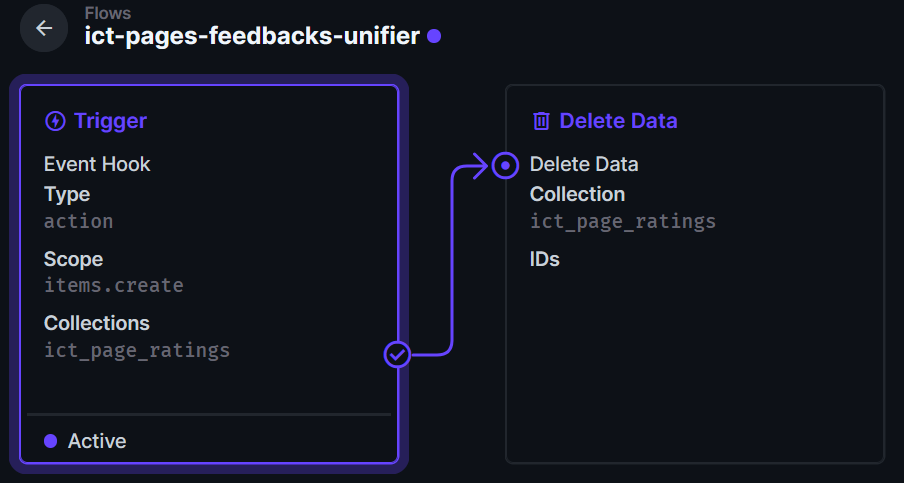

# Directus Page Ratings

Mit `@ict/directus` werden simple Page Ratings am Ende jeder Seite dargestellt.


## Frontmatter

Über das Frontmatter können zusätzliche Einstellungen vorgenommen werden:

`hide_rating`
: `boolean` - Versteckt die Page Ratings auf der Seite, auf der diese Einstellung gesetzt ist. Nützlich für Seiten, die nicht bewertet werden sollen (z.B. Startseite, Kontaktseite, etc.).
: @default `false`
`rating_label`
: `string` - Überschreibt die Standard-Beschriftung.
: @default `Rückmeldung zu dieser Seite?`

:::details[Zusammenfassung anzeigen]
Um die Zusammenfassung (durchschnittliche Bewertung und Anzahl der Bewertungen) anzuzeigen,
kann das Label 5x geklickt werden.
:::

## Directus Aufsetzen

### Directus Collection
Erstelle eine Collection (`ict_page_ratings`) mit folgenden Feldern:
- `id` (integer, autoincrement, primary key)
- `rating` (integer)
- `client_id` (string)
- `page_id` (string)
- `pathname` (string)
- `created_at` (datetime, autogeneriert)

### Directus Flow

Erstelle einen Flow um mehrfache Bewertungen vom selben Client zu bereinigen. Dies könnte auch durch DB-Constraints und `update` statt `create` zu verwenden, was mehr Client-Code erfordern würde.  



Trigger
: `items.create` Trigger auf `ict_page_ratings`
: `Non-Blocking`
Delete Data
: Collection `ict_page_ratings`
: Permission `full access`
: Query
:::dd
```json
{
    "filter": {
        "id": {
            "_neq": "{{$trigger.key}}"
        },
        "page_id": {
            "_eq": "{{$trigger.payload.page_id}}"
        },
        "client_id": {
            "_eq": "{{$trigger.payload.client_id}}"
        }
    }
}
```
:::
 
### CORS
Sicherstellen, dass die Directus-Instanz CORS-Anfragen von der Domain (ict-Seite) erlaubt.

```env title="/home/dokku/directus/ENV"
CORS_ENABLED="true"
CORS_ORIGIN="https://ict.gbsl.website"
```

### Access Policies

Damit ein nicht angemeldete Nutzer:in eine Bewertung abgeben kann, muss unter __Settings > Access Policies > Public Policy > #Permissions__ folgende Einstellung vorgenommen werden:

Collection
: `ict_page_ratings`
Actions
: `Create`
: `Read`


## Installation

1. `packages/ict/directus` kopieren und `yarn install` ausführen.
2. In der `siteConfig` die Directus-Konfiguration hinzufügen:
    ```ts title="siteConfig.ts"
    import { type DirectusConfig } from '@ict/directus';

    declare module './src/siteConfig/siteConfig' {
        export interface TdevConfig {
            directus: DirectusConfig;
        }
    }
    
    const getSiteConfig: SiteConfigProvider = () => {
        return {
            /*...*/
            tdevConfig: {
                directus: {
                    collection: 'page_ratings',
                    url: 'https://directus.foo.ch'
                }
            },
            apiDocumentProviders: [
                require.resolve('@ict/directus/register')
            ],
        }
    }
    ```
3. `DocItem.Footer` swizzeln (`wrap`):
    ```tsx title="src/theme/DocItem/Footer/index.tsx"
    import Footer from '@theme-original/DocItem/Footer';
    import PageRating from '@ict/directus/components/PageRating';
    import PageSummary from '@ict/directus/components/PageSummary';
    import { useDoc } from '@docusaurus/plugin-content-docs/client';
    
    type Props = WrapperProps<typeof FooterType>;

    type DocFrontMatter = {
        page_id: string;
        rating_label?: string;
        hide_rating?: boolean;
    };
    const FooterWrapper = (props: Props): ReactNode => {
        const { frontMatter } = useDoc();
        const {
            page_id: pageId,
            rating_label: ratingLabel,
            hide_rating: hideRating
        } = frontMatter as DocFrontMatter;
        return (
            <div>
                <PageRating pageId={pageId} label={ratingLabel} />
                <PageSummary pageId={pageId} />
                <Footer {...props} />
            </div>
        )
    };
    ```
