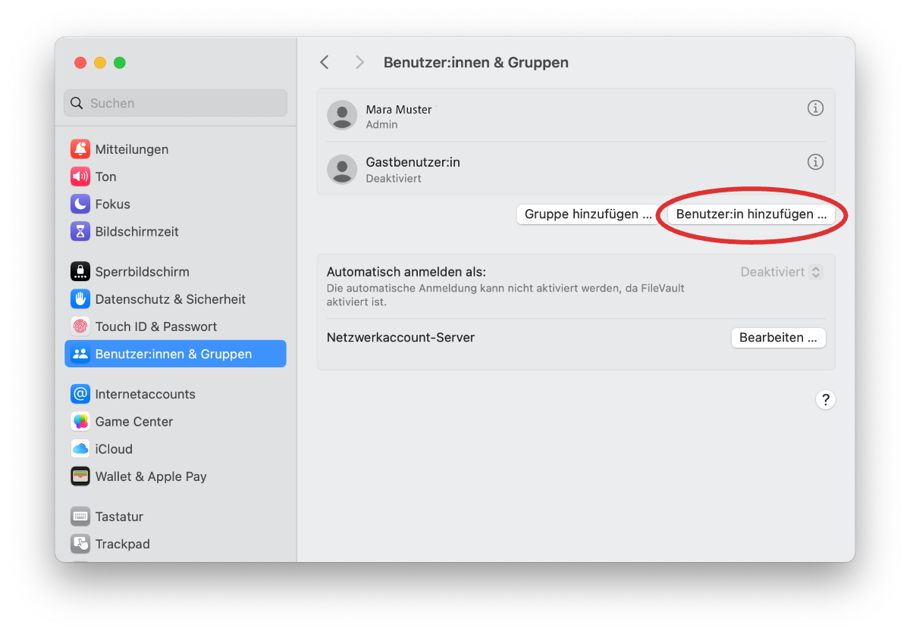
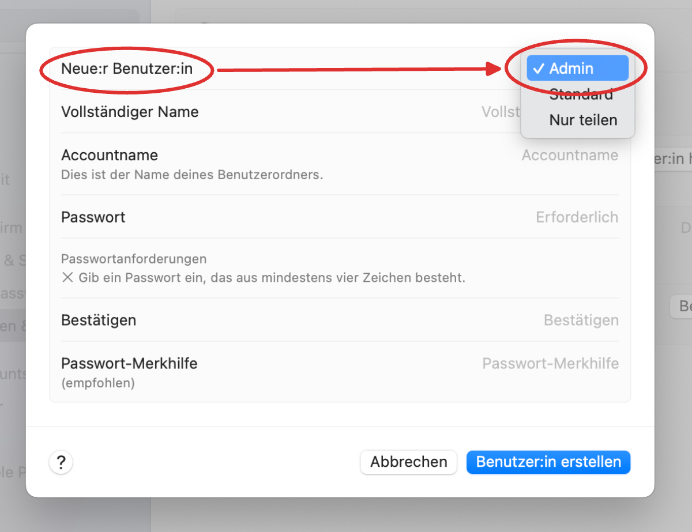

import PageReadCheck from '@tdev/page-read-check/PageReadCheck';

# Grundeinstellung: Adminrechte
Im Unterrichtsalltag werden Sie regelmässig neue Programme installieren oder Einstellungen an Ihrem Laptop vornehmen müssen. Dafür müssen Sie Ihren Computer so einrichten, dass Ihr Benutzerkonto über **Administratorrechte** verfügt.

## Kontotyp überprüfen
<Tabs groupId="os">
  <TabItem value="win" label="Windows">
    TBD.
  </TabItem>
  <TabItem value="mac" label="Mac">
    1. Öffnen Sie die Systemeinstellungen.
       
    2. Identifizieren Sie das Konto, mit dem Sie angemeldet sind. Prüfen Sie, ob dieses mit __Admin__ markiert ist. Sollte dies nicht der Fall sein, folgen Sie den Anweisungen unter [Kontotyp wechseln](#kontotyp-wechseln).
       
    3. Wenn Sie über ein Apple iCloud-Konto verfügen, stellen Sie sicher, dass Sie dazu **nicht Ihre Schul-Email-Adresse** verwendet haben, da Sie nach dem Austritt aus der Schule keinen Zugriff mehr auf dieses Konto haben werden. Falls Sie Ihre Schul-Email-Adresse für Ihr iCloud-Konto verwendet haben (sprich, sich mit Ihrer Schul-Email-Adresse bei iCloud einloggen müssen), müssen Sie diese [online anpassen](https://support.apple.com/de-ch/109353) und stattdessen eine **private, persönliche** E-Mail-Adresse verwenden.
  </TabItem>
</Tabs>

## Kontotyp wechseln
Sollten Sie festgestellt haben, dass Sie nicht mit einem Konto mit Administratorrechten angemeldet sind, müssen Sie dies anpassen, bevor Sie mit dem Onboarding fortfahren können.

<Tabs groupId="os">
  <TabItem value="win" label="Windows">
    TBD.
  </TabItem>
  <TabItem value="mac" label="Mac">
    1. Loggen Sie sich mit einem Konto ein, das über Administratorrechte verfügt. Fragen Sie dazu bei Bedarf Ihre Eltern oder Erziehungsberechtigten.
    2. Im selben Fenster wie bei der Überprüfung des Kontotyps (siehe oben) klicken Sie auf __Benutzer:in hinzufügen…__.
       
    3. Beim Erstellen des neuen Kontos wählen Sie unter __Benutzer:in__ den Typ __Admin__ aus.
        
    4. Erfassen Sie alle weiteren Angaben für das neue Konto (legen Sie ein Passwort fest und vergeben Sie einen Namen) und bestätigen Sie mit __Benutzer:in erstellen__.
    5. Melden Sie sich ab (z.B. indem Sie den Computer neu starten) und loggen Sie sich mit dem neu erstellten Konto ein. Verwenden Sie in Zukunft immer dieses Konto, wenn Sie Ihren Laptop verwenden.
  </TabItem>
</Tabs>

<PageReadCheck id="11e27390-f5b2-45dd-87e5-9d2e5a039885" />