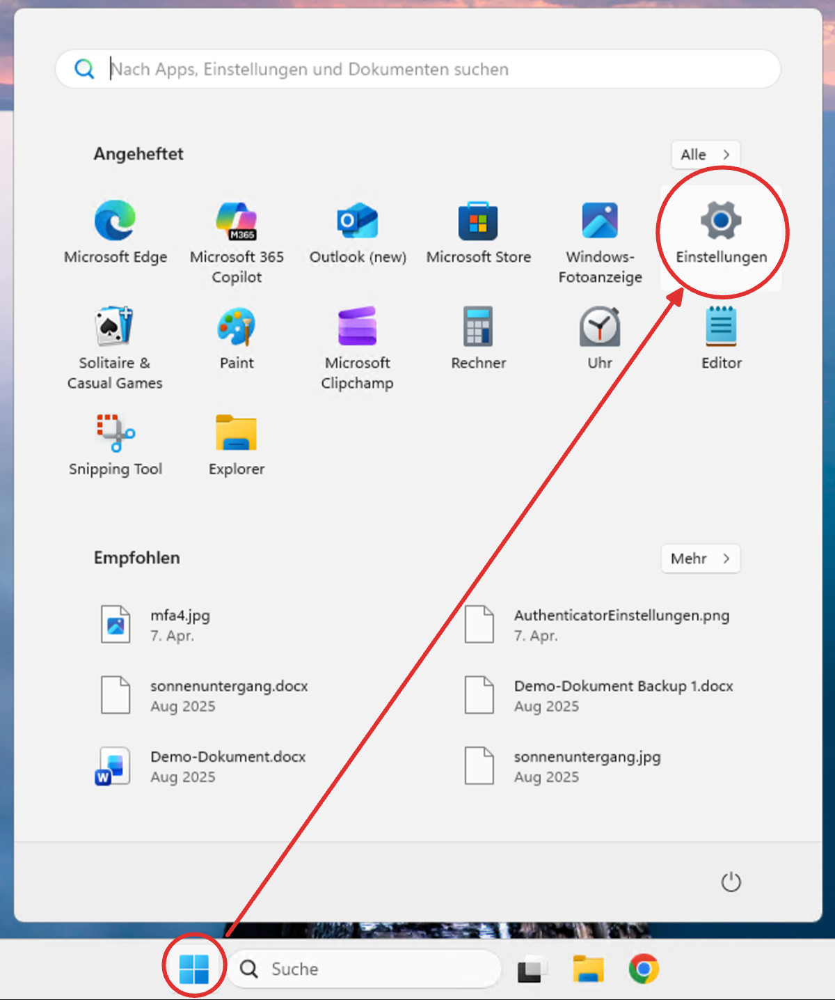
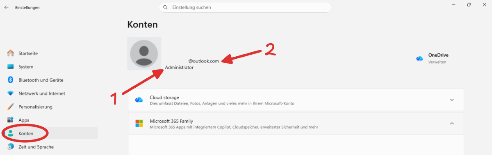
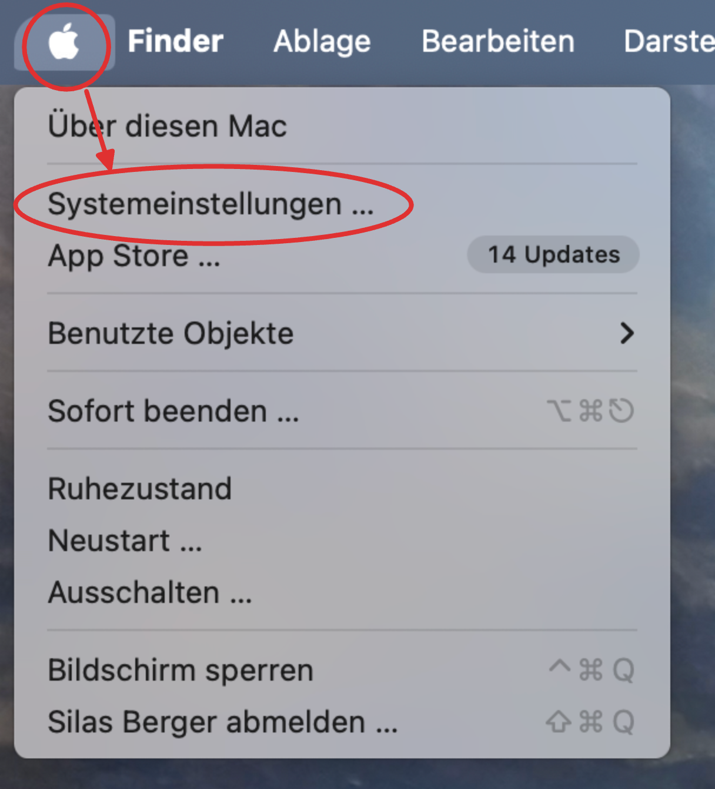
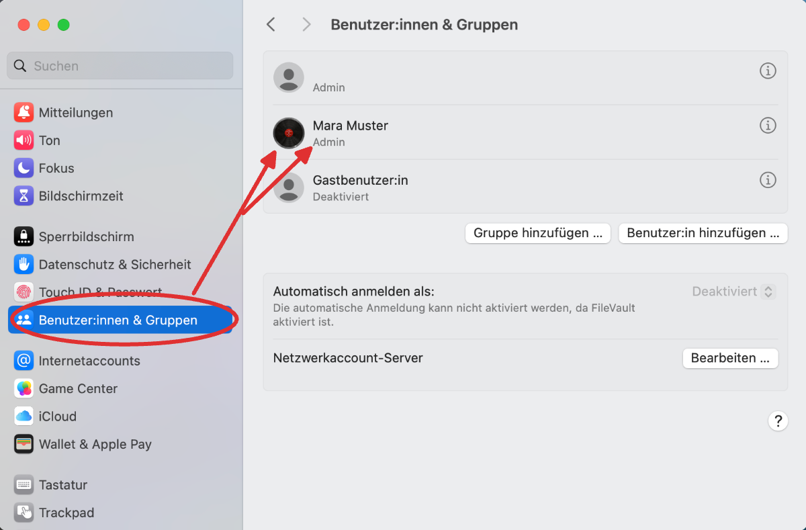
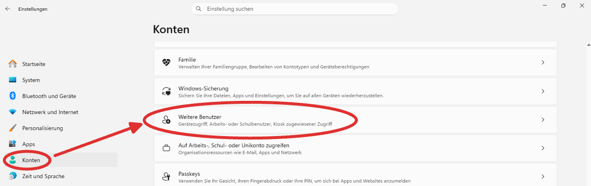
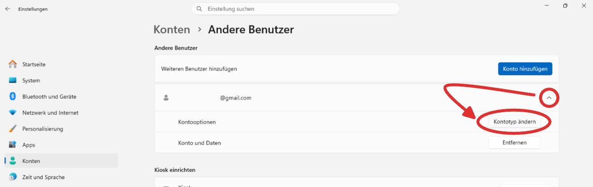
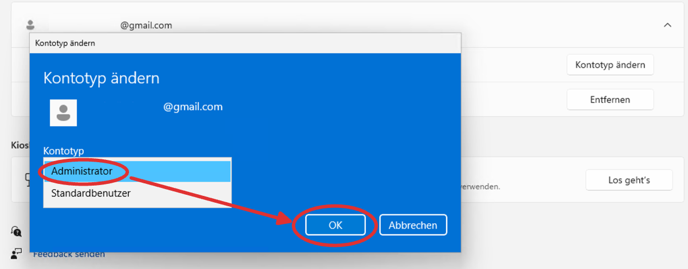
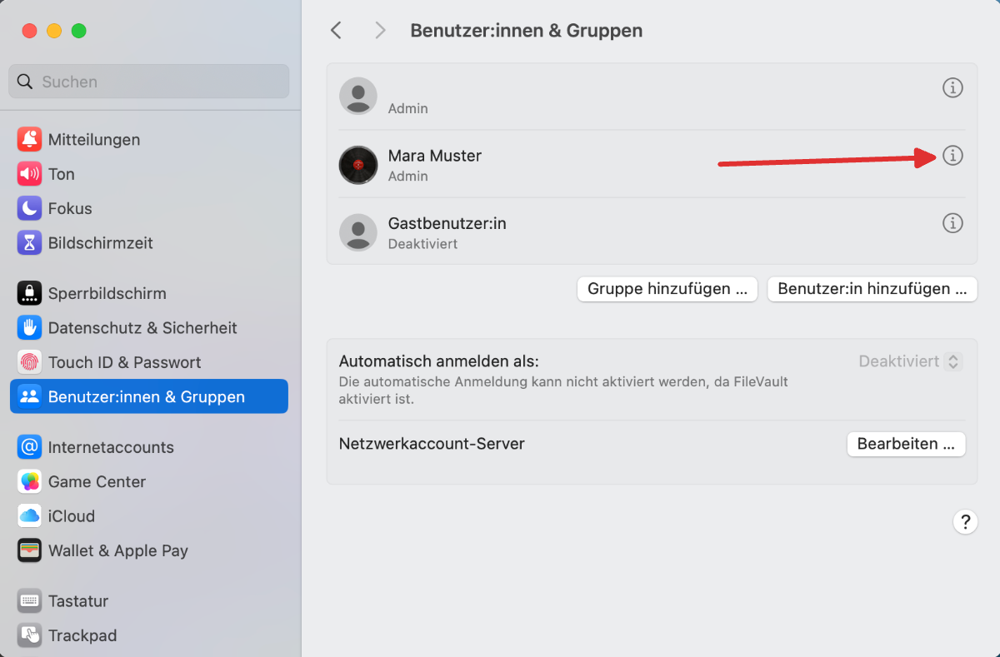
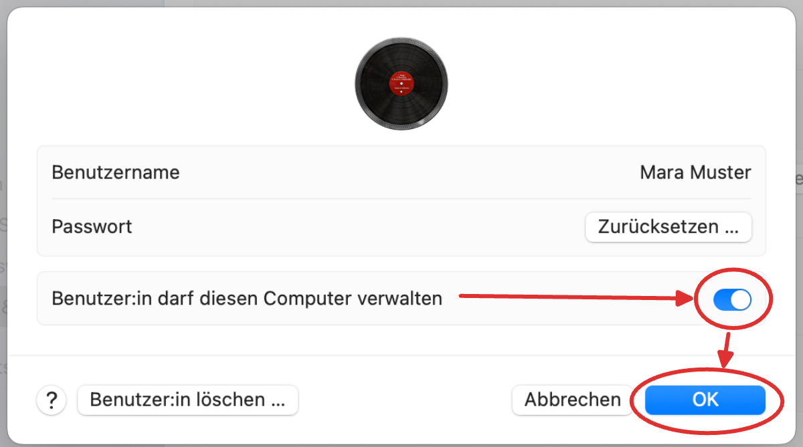

import PageReadCheck from '@tdev/page-read-check/PageReadCheck';

# Grundeinstellung: Adminrechte
Im Unterrichtsalltag werden Sie regelmässig neue Programme installieren oder Einstellungen an Ihrem Laptop vornehmen müssen. Dafür müssen Sie Ihren Computer so einrichten, dass Ihr Benutzerkonto über **Administratorrechte** verfügt.

## Kontotyp überprüfen
<Tabs groupId="os">
  <TabItem value="win" label="Windows">
    1. Öffnen Sie die Systemeinstellungen.
       
    2. Klicken Sie auf __Konten__.

       

       1
       :  Prüfen Sie, ob Ihr aktuelles Konto mit __Administrator__ markiert ist. Sollte dies nicht der Fall sein, folgen Sie den Anweisungen unter [Kontotyp wechseln](#kontotyp-wechseln).
       2
       : Stellen Sie sicher, dass Sie beim verwendeten Microsoft-Konto **nicht Ihre Schul-Email-Adresse** verwenden, da Sie nach dem Austritt aus der Schule keinen Zugriff mehr auf dieses Konto haben werden. Falls Sie Ihre Schul-Email-Adresse für Ihr Microsoft-Konto verwendet haben (sprich, sich mit Ihrer Schul-Email-Adresse bei Microsoft einloggen müssen), müssen Sie diese [online anpassen](https://support.microsoft.com/de-de/account-billing/ändern-der-e-mail-adresse-ihres-microsoft-kontos-0b1cbbd8-9a5e-4c8e-9a1e-7fbeaa1b2c8c) und stattdessen eine **private, persönliche** E-Mail-Adresse verwenden.
  </TabItem>
  <TabItem value="mac" label="Mac">
    1. Öffnen Sie die Systemeinstellungen.
       
    2. Identifizieren Sie das Konto, mit dem Sie angemeldet sind. Prüfen Sie, ob dieses mit __Admin__ markiert ist. Sollte dies nicht der Fall sein, folgen Sie den Anweisungen unter [Kontotyp wechseln](#kontotyp-wechseln).
       
    3. Wenn Sie über ein Apple iCloud-Konto verfügen, stellen Sie sicher, dass Sie dazu **nicht Ihre Schul-Email-Adresse** verwendet haben, da Sie nach dem Austritt aus der Schule keinen Zugriff mehr auf dieses Konto haben werden. Falls Sie Ihre Schul-Email-Adresse für Ihr iCloud-Konto verwendet haben (sprich, sich mit Ihrer Schul-Email-Adresse bei iCloud einloggen müssen), müssen Sie diese [online anpassen](https://support.apple.com/de-ch/109353) und stattdessen eine **private, persönliche** E-Mail-Adresse verwenden.
  </TabItem>
</Tabs>

:::aufgabe[Alles geprüft]
<TaskState id="0f228644-8fe2-43a5-b2fb-f18be6903666" />
Ich habe folgende Punkte geprüft:
- Mein Konto ist mit Administratorrechten eingerichtet.
- Ich bin mit einem Konto eingeloggt, das **nicht** meine Schul-Email-Adresse verwendet.
:::

## Kontotyp wechseln
Sollten Sie festgestellt haben, dass Sie nicht mit einem Konto mit Administratorrechten angemeldet sind, müssen Sie dies anpassen, bevor Sie mit dem Onboarding fortfahren können.

<Tabs groupId="os">
  <TabItem value="win" label="Windows">
    1. Loggen Sie sich mit einem Konto ein, das über Administratorrechte verfügt. Fragen Sie dazu bei Bedarf Ihre Eltern oder Erziehungsberechtigten.
    2. Öffnen Sie die Systemeinstellungen.
       
    3. Klicken Sie auf __Konten__ > __Weitere Benutzer__.
       
    3. Klappen Sie das Benutzerkonto aus, das dessen Kontotyp Sie ändern möchten, und klicken Sie auf __Kontotyp ändern__.
       
    4. Wählen Sie die Option __Administrator__ aus und bestätigen Sie mit __OK__.
       
    5. Melden Sie sich ab (z.B. indem Sie den Computer neu starten) und loggen Sie sich wieder mit Ihrem bisherigen Konto ein. Prüfen Sie nun nochmal, ob dieses Konto jetzt mit __Administrator__ markiert ist (siehe oben).
  </TabItem>
  <TabItem value="mac" label="Mac">
    1. Loggen Sie sich mit einem Konto ein, das über Administratorrechte verfügt. Fragen Sie dazu bei Bedarf Ihre Eltern oder Erziehungsberechtigten.
    2. Im selben Fenster wie bei der Überprüfung des Kontotyps (siehe oben) Klicken Sie auf das __i__-Symbol neben dem Konto, dem Sie Administratorrechte geben möchten.
       
    3. Aktivieren Sie die Option __Benutzer:in darf diesen Computer verwalten__ und bestätigen Sie mit __OK__.
       
    5. Melden Sie sich ab (z.B. indem Sie den Computer neu starten) und loggen Sie sich wieder mit Ihrem bisherigen Konto ein. Prüfen Sie nun nochmal, ob dieses Konto jetzt mit __Admin__ markiert ist (siehe oben).
  </TabItem>
</Tabs>

<PageReadCheck id="11e27390-f5b2-45dd-87e5-9d2e5a039885" />