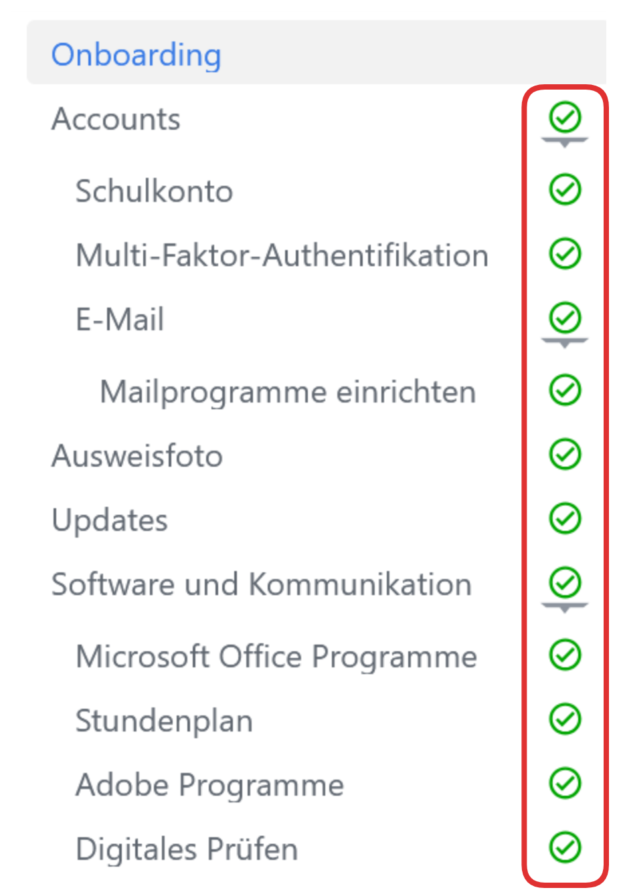
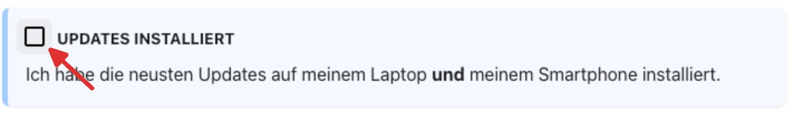
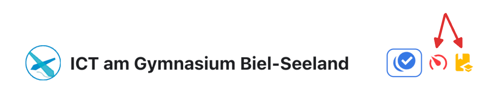
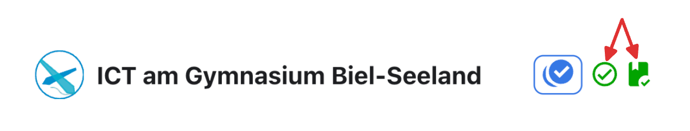

---
sidebar_custom_props:
  icon: mdi-file-document-outline
page_id: ed2b298f-838d-4c3b-b7a5-18a003d98c93
sidebar_position: 0
---

import ProgressState from '@tdev-components/documents/ProgressState';
import AllgemeineFrageOnboarding from '@tdev-components/MailTemplate/templates/AllgemeineFrageOnboarding';
import LanguageHelp from '@site/docs/03-support/10-language/_help.mdx';

# Onboarding
Herzlich willkommen auf der ICT-Webseite unserer Schule! Hier finden Sie Antworten und Lösungen bei technischen Fragen und Problemen. Speichern Sie Seite [ict.gbsl.website](https://ict.gbsl.website) deshalb am besten gleich in Ihren Favoriten / Lesezeichen ab oder notieren sie sich für später.

   
Version française ?

   

      <LanguageHelp />
   

## Einrichtung vor dem ersten Schultag

Was? &nbsp; :mdi[check-circle-outline]{.green}
: Alle Aufgaben sind erledigt.
Bis Wann? 🕑
: **15. Juni**
Wo? 💻
: Auf ihrem **Laptop**, den Sie am ersten Schultag\* mitbringen werden.
: Einige Aufgaben müssen zusätzlich auf ihrem **Smartphone** erledigt werden.
: \* <small>Falls Sie nach dem 15. Juni ein neues Gerät erhalten, müssen Sie die Onboarding-Aufgaben erneut auf dem neuen Gerät erledigen.</small>

Den Grossteil der Geräteeinrichtung können Sie bereits jetzt zu Hause erledigen. Es wird erwartet, dass Sie **dieses Onboarding bis am 15. Juni vollständig durchgearbeitet haben**.

Diesen Auftrag haben Sie erledigt, sobald das Menü auf der linken Seite bei Ihnen so aussieht:

:::info[Überprüfung am ersten Schultag]
Am erste Schultag wird überprüft, ob bei sämtlichen Onboarding-Kapiteln (inkl. Unterseiten) ein grünes Gutzeichen angezeigt wird.
:::

Um diese Gutzeichen zu erhalten, treffen Sie in den einzelnen Kapiteln auf folgende Arten von Aufträgen:

Aufgaben
: 
: Klicken Sie das Kästchen oben links an, um eine Aufgabe als erledigt zu markieren.
Slider
: 
: Ziehen Sie den Slider nach rechts, um zu bestätigen, dass Sie die Seite gelesen haben. **Gut zu wissen:** Jeder Slider hat eine Mindestlesezeit, die Sie einhalten müssen, bevor Sie den Slider ganz nach rechts ziehen können.
Schritte
:::dd
::video[./images/check-progress-state.mp4]{controls=false autoplay=true loop=true muted=true}
:::
: Um bei solchen Schritt-für-Schritt-Anleitungen den aktuellen Schritt als erledigt zu markieren, klicken Sie links davon auf den grünen Punkt und dann auf das Gutzeichen. So kommen Sie zum nächsten Schritt.

Auf jeder Seite dieses Onboardings finden Sie oben eine Übersicht mit den zu erledigenden Aufträgen. Werden diese schwarz, rot oder gelb angezeigt, heisst das, dass es hier noch etwas zu tun gibt:

:::tip[Zum Auftrag springen]
Klicken Sie in dieser Übersicht auf einen noch nicht erledigten Auftrag (noch nicht grün), um direkt dorthin zu springen.
:::

Sobald Sie auf einer Seite alles erledigt haben, sind alle Aufträge grün markiert und Sie können zur nächsten Seite weitergehen:

## Vorbereitung
:::danger[Altes Office-Konto entfernen]
Falls Sie von ihrer alten Schule ein Office365-Konto haben, müssen Sie dieses zuerst entfernen, bevor Sie das neue GBSL-Konto einrichten können. Bevor Sie weitermachen, befolgen Sie in diesem Fall <TLink newTab protocol="https" id="ict.legacy.domain" suffix="/anderesoftware/office365/#das-alte-schulkonto-wird-angezeigt">👉 diese Anleitung</TLink>.
:::

## Unterstützung
Falls Sie beim Einrichten Hilfe benötigen, können Sie sich beim IT-Support für Schüler:innen melden:
<AllgemeineFrageOnboarding />

Die entsprechende E-Mail-Adresse <TLink id="support.students.email" /> schreiben Sie sich für später bitte irgendwo auf, wo Sie sie jederzeit wiederfinden.

Weitere Unterstützung erhalten Sie auch in der [Anleitung von EDUBERN](https://erzbe.sharepoint.com/sites/EDUBERN-Infohub-Hilfsmittel/Lists/Hilfsmittel/Attachments/157/Anleitung%20–%20Onboarding%20EDUBERN%20BYOD%20FED_RESET_D.pdf) (dem Informatikdienstleister unserer Schule), sowie von deren [Chatbot](https://qr.edubern.ch/assistent).
